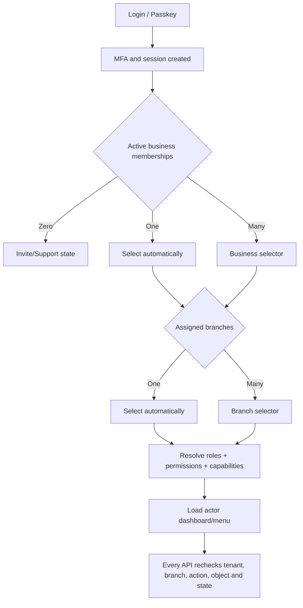
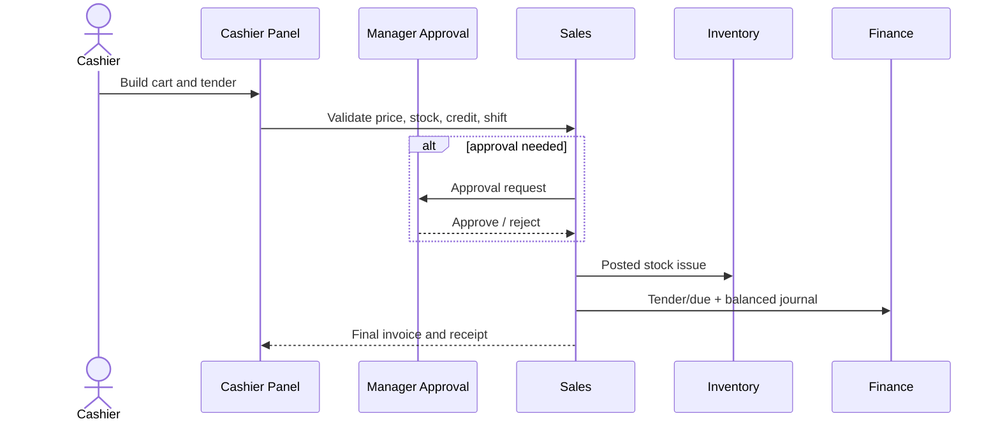
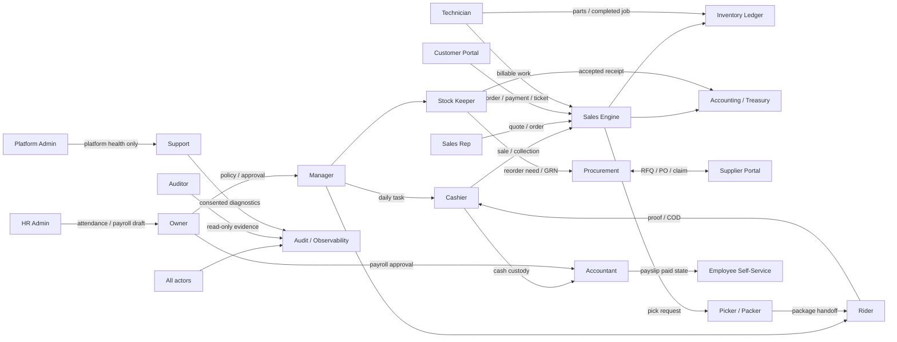

# B-SMART Business OS — Actor-wise Panel & Access Blueprint

**“Panel” definition:** একটি actor তার role, branch, assignment ও permission অনুযায়ী যে
নিজস্ব portal/dashboard/menu/actions পাবে। এটি page list নয়; এটি **কার panel, সে কী করবে,
কার কাছ থেকে কাজ পাবে এবং তার কাজ পরের কোন actor/module-এ যাবে**—তার specification।  
**Detailed screen inventory:** `docs/BSMART_PANEL_WISE_FEATURES.md`  
**Full system SRD:** `docs/BSMART_WORLD_CLASS_SRD.md`

---

## 1. Actor panel design-এর মূল নিয়ম

### 1.1 One identity, many actor contexts

আলাদা Owner login, Cashier login, Accountant login table থাকবে না। একজন মানুষের একটিই
`User` identity থাকবে; organization-এর `Membership`, role, branch assignment এবং permission
থেকে তার panel তৈরি হবে।

```text
User: Rahim
├── Rahim Pharmacy → Owner → all branches
├── ABC Wholesale → Accountant → Dhaka branch
└── XYZ Traders → Auditor → read-only
```

একই account login করে business নির্বাচন করলে সংশ্লিষ্ট actor panel খুলবে। একই business-এ
একাধিক role থাকলে permissions union করা যাবে, কিন্তু maker-checker conflict policy deny করবে।

### 1.2 Actor resolution logic



### 1.3 Panel access formula

```text
Effective Access =
  active user
  + active organization membership
  + assigned role permissions
  + assigned branch/warehouse/counter
  + enabled business capabilities
  + document state rules
  + approval/separation-of-duty rules
  + recent authentication for sensitive actions
```

Sidebar লুকানো security নয়। Actor কোনো URL সরাসরি খুললেও backend একই permission check করবে।

---

## 2. Authentication থেকে actor panel পর্যন্ত full journey

### Stage 1 — Public Visitor Panel

**Actor:** এখনো account নেই এমন visitor।  
**Can access:** Landing, business-type features, pricing, demo, security, help, signup/login।  
**Cannot access:** কোনো tenant data, internal report বা fake demo presented as live।

**Actions and handoff**

- “Start” → Prospective Owner onboarding।
- “Staff invite” link → Invited Staff acceptance।
- “Customer order/status” link → Customer Portal authentication।
- “Supplier collaboration” link → Supplier Portal authentication।

### Stage 2 — Identity Panel

**Actor:** Owner, staff, customer, supplier—সবাই একই identity service ব্যবহার করবে।

**Authentication features**

- Email/mobile + adaptive-hashed password অথবা passkey।
- OTP only for verified channel/purpose; expiring, rate-limited, consumed once।
- MFA: passkey preferred; TOTP/recovery codes fallback।
- Rotating session, device list, revoke one/all, suspicious-login alert।
- Password recovery এবং security event history।
- Actor-specific login page branding থাকতে পারে, authentication rules এক থাকবে।

**Authentication outcome**

- Owner/staff → organization + branch + work panel।
- Customer → own Customer Portal only।
- Supplier → invited supplier organization/data scope only।
- Platform staff → separate high-assurance Platform Panel।

### 2.1 Authentication entry points আলাদা ও সহজে চেনার নিয়ম

একটি generic form-এ “আমি Owner/Cashier/Admin” dropdown রাখা যাবে না। এতে user নিজের role দাবি
করার সুযোগ এবং confusion তৈরি হয়। Entry page আলাদা হবে, কিন্তু authentication engine এক থাকবে।

| Entry | Suggested route | কার জন্য | Account কীভাবে তৈরি হবে | সফল login-এর পর |
|---|---|---|---|---|
| ব্যবসা শুরু করুন | `/signup/business` | নতুন Owner | self-signup + OTP + business create | Onboarding Panel |
| Business Login | `/login/business` | Owner/Manager/Accountant/regular staff | existing membership or accepted invite | Role Resolver |
| Staff Invite | `/invite/staff/:token` | invited employee | one-time invite + identity create/link | Employee/assigned Work Panel |
| Customer Login | `/customer/login` | merchant customer | verified mobile claim/invite | Customer Portal |
| Supplier Login | `/supplier/login` | linked supplier user | buyer invitation + verification | Supplier Portal |
| Rider/Field Login | `/field/login` | rider, sales rep, technician | staff membership + device policy | assigned mobile task panel |
| Platform Login | `/platform/login` | B-SMART platform operator | manually provisioned high-assurance identity | Platform/Support/Security Panel |

Landing page-এ দুইটি primary button যথেষ্ট:

```text
[ব্যবসা শুরু করুন]  → Owner Sign-up
[লগইন করুন]         → Login Choice page
```

Login Choice page-এ বড় cards:

```text
আপনি কোথায় কাজ করেন?

[ব্যবসা পরিচালনা]  Owner, Manager, Cashier, Accountant, Staff
[Customer Portal] নিজের order, due, loyalty, service
[Supplier Portal] RFQ, PO, invoice, claim
[Field App]        Rider, Sales Rep, Technician

Platform staff? → ছোট পৃথক protected link
```

### 2.2 Owner Sign-up অন্য signup থেকে কীভাবে আলাদা হবে

Owner self-signup form:

1. Owner name, verified mobile/email, password/passkey।
2. Business name এবং broad business type।
3. OTP verification।
4. Atomic creation: `User + Organization + Owner Membership + First Branch Draft`।
5. Directly Onboarding Panel।

**Owner Sign-up page-এ থাকবে না:** Cashier/Manager/Platform Admin role picker। Owner role only
newly created business-এর জন্য system grants করবে। Existing business-এর Owner হতে invite/ownership
transfer workflow লাগবে।

### 2.3 Staff signup self-service নয়—invite-driven

Staff “Sign up” করে কোনো business খুঁজে join করতে পারবে না। Flow:

```text
Owner/HR enters staff contact + role + branch
→ system sends expiring invite
→ staff opens /invite/staff/:token
→ existing identity login OR new identity verify
→ invite details দেখবে
→ accept
→ Membership activated
→ system resolves assigned actor panel
```

Invite screen-এ business, inviter, role, branch, expiry স্পষ্ট থাকবে। Token role পরিবর্তন করতে বা
দ্বিতীয়বার ব্যবহার করতে পারবে না।

### 2.4 Login-এর পর actor নির্ধারণের exact algorithm

```text
1. Authenticate identity.
2. Verify account/session/MFA policy.
3. Load active memberships for the chosen portal audience.
4. If none: show correct recovery/invite/portal link; never auto-create privilege.
5. If multiple organizations: show Business Selector.
6. Load active role assignments and allowed branches.
7. Evaluate separation-of-duty restrictions and capability flags.
8. Build effective permission set on the server.
9. Select primary dashboard from priority rules below.
10. Return navigation manifest + scoped session context.
```

Primary dashboard priority:

| Effective assignment | Default panel |
|---|---|
| Organization Owner | Owner Panel |
| Branch Manager | Manager Panel |
| Cashier with active/required shift | Cashier/POS Panel |
| Stock/Warehouse role | Stock Keeper Panel |
| Procurement role | Procurement Panel |
| Finance/Accountant role | Accountant Panel |
| HR role | HR Panel |
| Rider/Technician/Sales Rep | respective task-focused Field Panel |
| Multiple non-owner roles | “My Work” combined dashboard + role switcher |
| Read-only/Auditor only | Auditor Panel |

Role switcher privilege দেয় না; শুধু already-effective permissions-এর UI perspective বদলায়। যেমন
একজন Manager + Accountant dashboard বদলাতে পারবে, কিন্তু Owner-only action পাবে না।

### 2.5 ভুল portal দিয়ে login করলে behavior

- Staff Customer Login page-এ credential দিলে customer portal access না থাকলে: “এই account-এর
  Customer Portal নেই”; Business Login link দেখাবে।
- Customer Business Login-এ গেলে business membership না থাকলে staff account auto-create হবে না।
- Supplier link ছাড়া Supplier Portal access নয়।
- Platform Login কোনো ordinary Owner membership-কে platform authority দেবে না।
- একই email/mobile multiple audience-এ বৈধভাবে linked হলে successful authentication-এর পর
  permitted contexts দেখাবে—password duplicate করতে হবে না।

### 2.6 সহজে চেনার UI identity

| Portal | Header color/icon cue | Header text | Always-visible context |
|---|---|---|---|
| Business App | primary brand + briefcase | “Business Login” | business, branch, work role |
| Customer | customer accent + shopping bag | “Customer Portal” | merchant/customer name |
| Supplier | supplier accent + truck | “Supplier Portal” | supplier + buyer business |
| Field | high-contrast mobile + route/tool | “Field Work” | today assignment, offline state |
| Platform | neutral/security + shield | “B-SMART Platform” | platform role, elevated session |

Color একমাত্র identifier নয়; text, icon, URL এবং page title সব আলাদা থাকবে। Browser title ও PWA
install name-ও audience অনুযায়ী স্পষ্ট হবে।

### 2.7 Authentication route guards

```text
/signup/business/*  → unauthenticated or pending-owner only
/app/*              → active business membership required
/customer/*         → active customer link required
/supplier/*         → active supplier link required
/field/*            → field-capable staff assignment required
/platform/*         → platform identity + phishing-resistant MFA required
```

Wrong audience-এর session থাকলে backend `403 PORTAL_SCOPE_REQUIRED` দেবে; frontend silently redirect
loop না করে permitted portal cards দেখাবে। Return URL allowlist করতে হবে যাতে open redirect না হয়।

---

## 3. Prospective Owner / Onboarding Panel

### Actor

নতুন ব্যবসার মালিক বা authorized business administrator।

### Dashboard

- Setup progress percentage এবং remaining checklist।
- Draft business, branch, import, opening balance ও invite status।
- “Go live readiness”: critical, recommended এবং optional tasks।

### Features

1. Business legal/trade identity, sector, language, fiscal year, address।
2. Vertical pack নির্বাচন এবং capability preview।
3. Branch, warehouse, counter এবং document prefix setup।
4. Cash/MFS/card/bank/due methods ও accounting mapping।
5. Product/service manual add অথবা CSV/XLSX import validation।
6. Opening stock with batch/expiry/serial/cost।
7. Opening cash/bank/MFS/customer due/supplier due।
8. Staff invite with role and branch।
9. Receipt/invoice branding and test print।
10. Review and confirm opening journal; first-sale guide।

### Integrations

```text
Owner Onboarding
→ Identity creates Owner membership
→ Organization creates business
→ Branch/Warehouse creates operating context
→ Import creates Catalogue + Opening Stock
→ Finance creates Opening Balances
→ IAM sends Staff Invites
→ Configuration activates Owner Panel
```

### Restrictions

- Opening balance confirmation-এর পরে direct edit নয়; adjustment workflow।
- Provider credential ছাড়া live payment/SMS/WhatsApp toggle চালু নয়।
- Essential setup অসম্পূর্ণ হলে sale start block বা explicit warning।

---

## 4. Owner / Business Super Admin Panel

### Actor objective

পুরো business-এর strategy, money, control, people এবং risk দেখা ও policy নির্ধারণ। Owner
daily data entry operator না হলেও system-এর সর্বোচ্চ business authority। Platform Admin নয়।

### Default dashboard

- Today/month sales, gross profit, expense, net operating result।
- Cash, bank, MFS/card clearing; unreconciled amount।
- Customer receivable এবং supplier payable ageing।
- Stock value, low/out/dead/expiring stock এবং cash locked।
- Branch comparison, staff target, pending payroll।
- Approval queue, security alerts, failed integration/sync/backup।
- Every number → source transaction/report drill-down।

### Owner menus

```text
Executive Dashboard
Approvals & Exceptions
Sales / Orders / Returns
Inventory / Purchase / Suppliers
Customers / Due / Loyalty / Campaign
Cash / Accounting / Tax / Reports
Staff / HR / Payroll / Commission
Delivery / COD / Vertical Operations
AI Insights / Recommendations
Business / Security / Integrations / Audit
```

### Owner actions

- Branch/warehouse/counter create, activate/deactivate।
- Staff invite/deactivate; role/permission/branch scope configure।
- Price/discount/credit/negative-stock/return policies।
- Approval rule publish and delegation।
- High-value purchase, refund, expense, payroll, period reopen approve।
- Accounting mapping, fiscal period close, export and backup review।
- Payment/message provider connect, sandbox/live enable and secret rotation।
- Vertical pack/feature flag enable after prerequisite review।
- B-SMART recommendation accept/modify/reject এবং outcome review।

### Owner restrictions and safety

- Posted invoice/journal/stock movement delete/edit নয়; reversal/adjustment।
- Last active owner remove করা যাবে না।
- নিজের তৈরি transaction নিজে approve maker-checker policy চালু থাকলে পারবে না।
- Payroll, secret, role, export, period-reopen action-এ MFA/recent login।
- Support/platform access owner-এর অদৃশ্য impersonation হতে পারবে না।

### Owner receives from / sends to

| Receives from | Owner decision | Sends to |
|---|---|---|
| Manager | discount/refund/operation exception | approved command back to branch |
| Procurement | high-value PR/PO/variance | supplier PO/finance payable |
| Accountant | reconciliation/period/payroll exception | approve/reject/rework |
| HR | payroll/role/leave policy | payroll payment/accounting |
| AI engine | explained recommendation | PO/task/campaign draft |
| Security | suspicious login/export/secret event | revoke/investigate/support |

---

## 5. Branch Manager Panel

### Actor objective

Assigned branch-এর daily operation ঠিক রাখা: sales, stock, shift, staff, delivery এবং approval।

### Dashboard

- Hourly/today sales; target vs actual; active counters/shifts।
- Held/pending orders, reservation, picking, delivery queue।
- Low/out stock, transfers, GRN/QC, count variance, expiry।
- Attendance/missing staff; operational tasks।
- Pending discount/refund/void/credit/stock-adjustment approvals।
- Cash shift variance এবং MFS/card pending reconciliation।

### Can do

- Assigned branch sale/order/return supervise।
- Allowed threshold পর্যন্ত discount/refund/void approve।
- Cashier shift reopen/variance review under policy।
- Stock count assign/approve, transfer request, damage/quarantine decision।
- Purchase request এবং local receiving exception handle।
- Roster/attendance correction/leave first-level approval।
- Rider/technician/kitchen assignment and escalation।
- Branch-specific report and audit view।

### Cannot do by default

- Organization ownership, subscription বা platform settings পরিবর্তন।
- Org-wide role/security policy/integration secret edit।
- Closed accounting period reopen বা unrestricted payroll salary view।
- Other branch data unless explicitly assigned।
- নিজের variance/expense/stock adjustment নিজে approve, if SoD enabled।

### Integration flow

```text
Cashier / Stock / Rider / Staff exceptions
→ Branch Manager queue
→ approve within limit OR escalate Owner
→ domain service executes
→ Accounting + Audit + Notifications update
```

---

## 6. Cashier / POS Operator Panel

### Actor objective

দ্রুত ও নির্ভুল sale, receipt, customer collection এবং নিজের cash custody পরিচালনা।

### Default dashboard

- Current shift `closed/open/suspended/close pending`।
- “New Sale” primary action; held bills এবং recent invoices।
- Own tender summary, pending provider payments, offline sync status।
- Printer/scanner state এবং actionable conflicts।

### Can do

1. Opening cash denomination দিয়ে shift open।
2. Barcode/search/variant/batch/serial দিয়ে cart তৈরি।
3. Customer select/create limited profile; loyalty redeem।
4. Allowed price/discount/tax policy apply।
5. Cash/MFS/card/bank/due/split tender গ্রহণ।
6. Receipt print/share/reprint।
7. Hold/resume bill; quotation/order load।
8. Original invoice থেকে permitted return request তৈরি।
9. Own shift cash-in/out/drop request এবং blind close count।
10. Offline allowed cash sale queue এবং conflict resolution request।

### Must request approval for

- Threshold-এর বেশি discount বা manual price override।
- Customer credit limit exceed/due without customer।
- Refund/void, closed shift correction, negative stock।
- Cash adjustment এবং unusual receipt reprint policy।

### Cannot see/do

- Cost price/gross profit by default।
- Supplier payable, payroll, company-wide finance।
- Another cashier’s shift details।
- Posted invoice edit/delete বা provider payment manually mark successful।
- Integration/settings/role/export।

### Transaction flow



---

## 7. Stock Keeper / Warehouse Operator Panel

### Actor objective

Physical stock আর system stock এক রাখা; receiving, storage, movement, count ও batch/serial control।

### Dashboard

- Today incoming GRNs, pending QC, pick/transfer tasks।
- Low/out stock; expiring/damaged/quarantined items।
- Open stock counts এবং unresolved variances।
- In-transit overdue/discrepancy।

### Can do

- PO-based GRN draft: accepted/rejected, batch, expiry, serial, location।
- Barcode/label print, put-away, bin transfer।
- Transfer pick/dispatch/receive এবং discrepancy record।
- Blind stock/cycle count; recount request।
- Damage/quarantine/expiry/recall movement request।
- Order pick/pack scanner verification।
- Stock movement ledger read and source document drill-down।

### Cannot do by default

- Purchase price change, supplier payment or sales margin report।
- Count variance নিজে approve/post if maker-checker।
- Direct balance edit; every change must be movement।
- PO amount/terms modify বা journal edit।

### Sends to

- GRN → Procurement + Payable + Accounting।
- Count variance/damage → Manager approval + Accounting।
- Low stock → Reorder/Procurement।
- Pick complete → Delivery/Rider।

---

## 8. Procurement Officer / Buyer Panel

### Actor objective

সঠিক supplier থেকে সঠিক quantity/cost/time-এ purchasing পরিচালনা।

### Dashboard

- Reorder suggestions, approved PR, RFQ deadlines।
- PO awaiting approval/issue, late/partial delivery।
- Price/quantity/invoice match variance এবং supplier claim।
- Supplier performance and purchasing budget consumption।

### Can do

- Reorder/production/manual need থেকে Purchase Request।
- RFQ send, supplier quotation capture, landed-cost comparison।
- Draft PO, submit approval, approved PO issue/share।
- Delivery follow-up; GRN monitor, invoice match resolution।
- Purchase return/claim initiate and track।
- Supplier catalogue, lead time and approved commercial terms maintain।

### Cannot do by default

- নিজের PO approve, supplier invoice pay বা bank/MFS destination একা বদলানো।
- Physical receipt quantity falsely complete; Warehouse/GRN actor owns receipt evidence।
- Journal edit বা tender reconciliation।

### Flow

```text
Reorder / Stock / Department Request
→ Procurement PR
→ Manager/Owner Approval
→ RFQ/PO
→ Stock Keeper GRN/QC
→ Accountant 3-way match/Payable
→ Authorized payment
→ Supplier score/outcome
```

---

## 9. Accountant / Finance Officer Panel

### Actor objective

Business-এর cash, due, payment, ledger এবং financial close নির্ভুল ও reconciled রাখা।

### Dashboard

- Cash/MFS/card/bank unreconciled amount and age।
- Customer receivable/supplier payable ageing।
- Pending expenses, supplier invoice match and payment batches।
- Unposted/failed journals, trial balance status, close checklist।
- Cashier variance and provider settlement exception।

### Can do

- Customer collection and supplier settlement allocate।
- Expense draft/review/pay under permission।
- Bank/MFS/card statement import and reconciliation।
- Chart of accounts read/authorized maintenance।
- Balanced manual/adjusting journal submit; reversal request।
- Trial Balance, P&L, Balance Sheet, Cash Flow and tax registers।
- Period close preparation and reconciliation evidence।
- Payroll payment batch after HR/Owner approval।

### Must not do by default

- Payroll prepare এবং approve/pay—সব একা নয়।
- নিজের expense/payment approve।
- Sales invoice/stock quantity edit।
- Closed period silently reopen/backdate।
- Provider secret/role policy change।

### Integration

Sales, purchase, return, expense, payroll এবং COD থেকে posting commands আসে; Accountant এসবের
source transaction বদলায় না, exception reconcile/reverse করে। Financial statement শুধু Journal
থেকে তৈরি হবে।

---

## 10. Sales Representative / CRM Agent Panel

### Actor objective

Assigned customer/territory-এর lead, quotation, order, collection ও relationship পরিচালনা।

### Dashboard

- Today follow-ups/visits, open leads/quotes/orders।
- Assigned customers’ due and collection promises।
- Sales/collection target, eligible commission and returns impact।
- Delivery/order exceptions requiring customer communication।

### Can do

- Lead/customer create within assigned territory; consent capture।
- Activity/note/visit, quotation and sales order draft।
- Allowed price book; special price request approval।
- Collection record with verified tender/reference and receipt।
- Order/delivery status share, support ticket create।
- Own performance and commission transaction detail।

### Restrictions

- Other representative customer export নয়।
- Customer credit limit change/hold release নয়।
- Collection delete/edit or provider success forge নয়।
- Cost/profit/payroll unless separate permission।

### Flow

Lead → Customer → Quote → Order → Reservation/Warehouse → Delivery → Invoice/Collection →
Commission। Return হলে commission clawback automatically।

---

## 11. HR / People Administrator Panel

### Actor objective

Staff lifecycle, roster, attendance, leave, policy এবং payroll preparation।

### Dashboard

- Today present/late/absent/missing punch।
- Pending leave/correction/invite/document expiry।
- Roster gaps and overtime risks।
- Payroll input completeness এবং approval status।

### Can do

- Staff employment profile, branch, manager, job title maintain।
- Invite/resend/revoke; role request (security approval policy অনুযায়ী)।
- Roster publish and substitution।
- Attendance exception/correction review preserving original।
- Leave policy/balance/request workflow।
- Salary component, advance/deduction, commission import and payroll draft।
- Payslip publish after approved/paid state।
- Performance goals/review access according to policy।

### Cannot do alone

- নিজের salary/attendance correction approve।
- Payroll prepare + approve + pay all three stages।
- Owner/high-risk role নিজে grant।
- Employee security credential/MFA secret দেখতে।

### Handoff

Attendance + Leave + Commission → Payroll Draft → Owner/Finance Approval → Accountant Payment →
Payslip/Journal।

---

## 12. Employee Self-Service Panel

### Actor objective

নিজের work information দেখা এবং request জমা দেওয়া; অন্য staff-এর private data নয়।

### Features

- Own roster, attendance/check-in/out, missing-punch correction request।
- Leave balance/calendar/request/cancel।
- Assigned tasks, targets and permitted commission details।
- Payslip, salary payment status, advance balance।
- Profile/contact update request, documents and announcements।
- Security devices/sessions/password/MFA management।

### Restrictions

- Own salary rule/edit, attendance approval, role/branch assignment নয়।
- Other employee payroll/personal document নয়।

---

## 13. Technician / Service Engineer Panel

### Actor objective

Assigned service/repair job diagnostic workflow, parts/time এবং completion evidence পরিচালনা।

### Dashboard

- New/accepted/in-progress/waiting parts/customer/ready jobs।
- Appointments, SLA overdue, warranty callbacks।
- Parts reservation/shortage and QC return।

### Can do

- Intake details/photos/serial এবং reported symptom read।
- Diagnosis note, estimate parts/labor/time draft।
- Customer-approved estimate after notification view।
- Parts request/issue/unused return; work timer/status।
- External service handoff, QC checklist, ready-for-delivery।
- Warranty/rework linkage।

### Restrictions

- Estimate/customer price approval ছাড়া কাজের invoice post নয়।
- Warehouse stock direct edit নয়; parts issue/return movements।
- Payment collect only if separate cashier permission।

### Flow

Customer/Front Desk Job Card → Technician Diagnosis → Manager/Customer Estimate Approval →
Parts Inventory → Work/QC → Cashier Invoice/Payment → Warranty History।

---

## 14. Restaurant actors

### 14.1 Waiter / Front-of-House Panel

- Floor/table state, reservation, guest count, table order।
- Menu/modifier/note; send course to kitchen; add/transfer/merge/split with permission।
- Ready alert, serve status, bill request।
- Cannot mark kitchen prepared or payment successful।

### 14.2 Kitchen / Bar Station Panel

- Only assigned station tickets: new → accepted → preparing → ready।
- Item modifier/instruction, elapsed SLA, recall/re-fire/waste reason।
- No price/customer finance visibility beyond operational need।

### 14.3 Restaurant Cashier Panel

- Table/takeaway/delivery bills, split/merge payment, discount approval, shift।
- Kitchen state ও payment state আলাদা; bill close updates recipe consumption/accounting।

### 14.4 Restaurant Manager Panel

- Floor/KDS load, void/waste/discount approvals, staff and stock exceptions, food-cost report।
- Prepared item cancellation → wastage/manager audit।

---

## 15. Manufacturing actors

### 15.1 Production Planner Panel

- Demand/reorder থেকে plan; BOM/routing version; material/capacity availability।
- Production order create/release; schedule/work center।

### 15.2 Production Operator Panel

- Assigned work order, start/pause/complete operation।
- Actual material/labor/output/scrap/by-product record।
- Cannot change BOM/cost/approved quantity without exception।

### 15.3 Quality Control Panel

- Incoming/in-process/final QC checklist, sample/result, accept/reject/quarantine/rework।
- Independent evidence; operator cannot self-approve if policy enabled।

### 15.4 Production Supervisor Panel

- Work-center status, delay/material shortage, yield/scrap variance।
- Approve exception/rework within limits; complete/close order।

### Flow

Planner Order → Warehouse Material Issue → Operator Production/WIP → QC → Finished Goods Receipt →
Accounting Cost/Variance → Sales Inventory।

---

## 16. Picker / Packer Panel

### Actor objective

Confirmed/reserved sales order সঠিকভাবে warehouse থেকে pick এবং package করা।

### Features

- Assigned wave/list ordered by bin/location।
- Scan item, variant, batch, serial and quantity verification।
- Short/damaged/wrong-stock exception এবং substitute request।
- Pack/weight/package barcode/seal; invoice/challan print।
- Handoff scan to rider/courier।

### Restrictions

- Price/order/payment edit নয়।
- Reservation ছাড়া বা wrong serial/batch confirm নয়।

---

## 17. Rider / Delivery Agent Panel

### Actor objective

Assigned package deliver করা এবং COD/proof নিরাপদে handover করা।

### Dashboard

- Today route, pickups, stops, COD expected, failed/retry/RTO।
- Online/offline sync and pending proof/handover।

### Can do

- Package pickup scan; out-for-delivery।
- Map/call, limited customer delivery information।
- OTP/signature/photo proof; delivered/failed reason/retry।
- COD collected amount এবং denomination record।
- End-of-run COD handover to cashier।

### Cannot do

- Order item/price/COD amount/customer credit edit।
- নিজের COD shortage approve বা cash handover একতরফা complete।
- Unassigned delivery/customer list view।

### Flow

Delivery Manager Assignment → Picker Handoff → Rider Proof/COD → Cashier Counts → Manager Exception
Approval → Treasury/Accounting Reconciliation। “Delivered” এবং “business received COD cash” আলাদা state।

---

## 18. Auditor / Read-only Reviewer Panel

### Actor objective

Evidence-based review; কোনো operational mutation নয়।

### Features

- Permission-scoped financial statements, registers, stock movement, approvals, audit trail।
- Document-to-journal-to-stock/payment trace।
- Filter/export with watermark, reason and audit।
- Period/branch comparison and reconciliation evidence।

### Restrictions

- Create/edit/approve/reverse/pay/export PII by default নয়।
- Secret, password, OTP, token, full payment credential কখনো নয়।
- Auditor role being read-only must be server-enforced।

---

## 19. Customer Portal / Buyer Panel

### Actor objective

নিজের profile, order, invoice, due, payment, delivery, loyalty, service এবং support দেখা।

### Authentication

- Verified mobile/email OTP/passkey; organization customer link confirmation।
- One identity multiple merchants support; merchant data isolated।

### Features

- Catalogue/service availability and quote/order request।
- Own quotations accept/reject; orders/status/cancel policy।
- Invoice/receipt/download; due balance and payment link/history।
- Delivery address/slot/tracking, OTP confirmation।
- Return/exchange/service request; ticket conversation।
- Loyalty balance/history/reward; consent/preferences/opt-out।
- Data/profile correction request।

### Restrictions

- Other customer/order, internal cost/margin, staff note, supplier data নয়।
- Browser payment success authoritative নয়; provider verification required।
- Customer cannot directly alter invoice/due/credit limit।

### Integration

Customer Order → Sales/Reservation → Warehouse → Rider → Invoice/Payment → Loyalty/Support।

---

## 20. Supplier Portal Panel

### Actor objective

Buyer business-এর সাথে RFQ, PO, delivery, invoice এবং claim নিরাপদে collaborate করা।

### Authentication and scope

- Business invitation + verified supplier user।
- Only linked buyer organizations এবং shared documents।
- Buyer business-এর internal comparative quote/budget/other suppliers দেখা যাবে না।

### Features

- RFQ view; quote price/terms/lead time/validity submit।
- Award/PO acknowledge, proposed delivery schedule।
- ASN/delivery details এবং documents upload।
- Supplier invoice/credit note submit; payment/remittance status।
- Purchase return/claim respond, replacement/credit tracking।
- Own performance metrics and profile/payment-destination change request।

### Restrictions

- Buyer GRN/accepted quantity নিজে confirm নয়।
- Payment destination change instantly effective নয়; buyer MFA/approval/verification।
- Buyer stock/sales/customer/accounting data নয়।

### Flow

Procurement RFQ/PO → Supplier Quote/Acknowledge → Warehouse GRN → Accountant Match → Payment →
Supplier Remittance; claim loop Purchase Return → Supplier Response → Replacement/Credit।

---

## 21. Platform Super Admin Panel

### Actor objective

B-SMART SaaS/platform health, tenant lifecycle, release, subscription এবং security operation। এটি
business Owner Panel-এর উপরে নয়; আলাদা authority domain।

### Dashboard

- Service availability/latency/error, background queues, webhook/provider health।
- Tenant/user/branch usage aggregates, backups, migrations, releases/incidents।
- Subscription/plan/billing exceptions without unnecessary tenant transaction detail।

### Can do

- Tenant create/suspend/reactivate through controlled policy।
- Feature rollout/canary, migration monitor and rollback।
- Provider/global integration health, rate limit and incident management।
- Support access request approve under policy; security containment।
- Plan/usage/billing configuration।

### Cannot do silently

- Tenant owner হিসেবে impersonate, invoice edit, funds move, sale/stock/payroll change।
- Credential/secret plaintext দেখা।
- Support reason/tenant visibility/audit ছাড়া private data access।

### High assurance

Hardware/passkey MFA, short session, restricted network/device, step-up, two-person approval for
critical actions এবং immutable platform audit।

---

## 22. Support Agent Panel

### Actor objective

Tenant issue diagnose করা, business operation নিজে চালানো নয়।

### Features

- Ticket, customer consent/access grant, app/version/device/health diagnostics।
- Sanitized logs/correlation ID, failed job/integration status, documentation।
- Time-bound read access; explicit “support is viewing” indicator।
- Escalate engineering/security/provider; resolution notes।

### Restrictions

- Password/OTP/token/secret/full card data নয়।
- Money/stock/role/payroll mutation নয়; exceptional repair tool হলে two-person approval,
  dry-run, before/after evidence and owner notification।

---

## 23. Security / Compliance Operator Panel

### Actor objective

Platform বা large organization-এর security event, access review এবং incident response।

### Features

- Suspicious login/session/export/API key/role/secret events।
- User/session/key revoke, containment and investigation case।
- Periodic access/role review; dormant/high-risk account report।
- Retention/legal hold/data request workflow।
- Security finding, dependency/secret scan and remediation status।

### Restrictions

- Business transaction approve/pay/edit নয় unless separately assigned and conflict-safe।
- Logs minimize/redact PII; investigation access audited।

---

## 24. Actor-to-actor workflow map



---

## 25. Actor integration responsibility matrix

| Business event | Initiates | Reviews/approves | Executes/records | Receives outcome |
|---|---|---|---|---|
| Normal sale | Cashier/Sales Rep/Customer | policy engine/Manager if needed | Sales + Inventory + Finance | Customer, Owner dashboard |
| Refund/void | Cashier/Support request | Manager/Owner | Sales reversal + Treasury | Customer, Accountant |
| Purchase | Stock/Procurement | Manager/Owner | Procurement | Supplier, Warehouse |
| Goods receipt | Stock Keeper | QC/Manager for variance | Inventory + Payable | Procurement, Accountant |
| Supplier payment | Accountant | Owner/authorized approver | Treasury + Accounting | Supplier Portal |
| Stock adjustment | Stock Keeper | Manager/Owner | Inventory + Accounting | Auditor/Owner |
| Customer credit increase | Sales/Customer manager | Manager/Owner | CRM policy | Cashier/Order panel |
| Cash shift close | Cashier | Manager if variance | Treasury | Accountant/Owner |
| COD completion | Rider | Cashier count + Manager exception | Treasury + Accounting | Customer/Owner |
| Payroll | HR | Owner/Finance maker-checker | Accountant/Treasury | Employee |
| Job completion | Technician | QC/Manager/Customer estimate | Service + Sales + Stock | Customer/Cashier |
| Period close | Accountant | Owner | Accounting | Reports/Auditor |
| AI recommendation | AI engine | Owner/Manager | creates approved draft/task only | Procurement/CRM/etc. |

---

## 26. Recommended minimum actor panels by business type

| Business type | Required actor panels | Optional/specialized panels |
|---|---|---|
| Small retail/pharmacy | Owner, Manager, Cashier, Stock, Procurement, Accountant | Customer, Supplier, Rider |
| Wholesale/distribution | Above + Sales Rep, Picker, Rider/COD | Customer/Supplier portal |
| Restaurant | Owner, Restaurant Manager, Waiter, Kitchen, Cashier, Stock, Accountant | Rider/Customer |
| Service/electronics | Owner, Front Desk/Cashier, Technician, Stock, Accountant | Customer/Supplier |
| Manufacturing | Owner, Planner, Operator, QC, Warehouse, Procurement, Accountant | Sales Rep/Customer |
| Salon/appointment | Owner/Manager, Front Desk, Service Staff, Cashier, HR | Customer portal |
| Transport/courier | Owner/Manager, Dispatcher, Rider/Driver, COD Cashier, Accountant | Customer portal |
| Rental/event | Owner/Manager, Booking Agent, Warehouse/Asset, Delivery, Accountant | Customer portal |

Small business-এ একজন মানুষ multiple roles নিতে পারে; system একই UI-তে permissions combine করবে।
তবে payment, payroll, stock adjustment ও high-risk approval-এ possible হলে maker-checker থাকবে।

---

## 27. Actor panel-এর universal UX rules

প্রত্যেক actor panel-এ থাকবে:

1. Current business, branch/warehouse/counter এবং role context স্পষ্ট।
2. Actor-এর “আজকের কাজ” প্রথমে; unrelated menu নয়।
3. Permission নেই এমন action hide/disable এবং API deny; sensitive data mask।
4. Notification source document-এ deep-link করবে।
5. Loading, empty, offline, syncing, conflict, rejected এবং provider-failed state।
6. Every approval-এ amount/impact/before-after/requester/rule দেখা যাবে।
7. Every posted record-এ audit timeline ও related stock/payment/journal linkage।
8. বাংলা-first simple labels; technical accounting/status detail expandable।
9. Mobile actor panels task-focused: Cashier scan, Rider proof, Technician job, Employee self-service।
10. Actor switch only authorized membership/role context-এ; unsynced কাজ থাকলে warning।

---

## 28. Actor panel completion criteria

কোনো actor panel “complete” হবে যখন:

- তার login → business/branch select → dashboard → primary task → outcome end-to-end চলে;
- সে যা দেখতে পারবে না, UI এবং API উভয়েই blocked;
- actor-to-actor handoff notification/task/approval সত্যিই কাজ করে;
- retry/offline/duplicate action financial বা stock duplication করে না;
- source document, inventory, payment/due, journal এবং audit reconcile করে;
- separation-of-duty এবং step-up authentication tested;
- বাংলা/English, mobile/desktop, keyboard/accessibility and print tested;
- real role user acceptance scenario pass করে।

World-class actor panel-এর মানে বেশি menu নয়—**সঠিক actor-এর সামনে সঠিক সময়ে সঠিক কাজ,
ন্যূনতম sensitive data এবং সম্পূর্ণ traceable handoff**।
