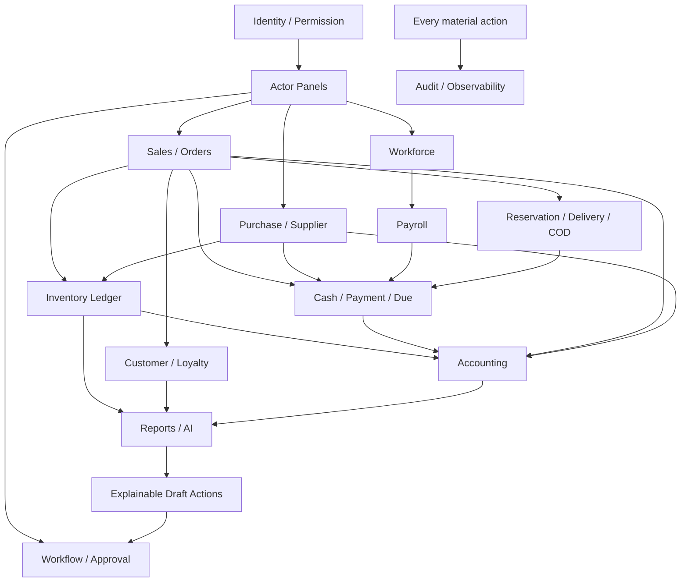

# B-SMART — Complete No-Code Product & Experience Plan

**Scope:** Product, actor panel, authentication, workflow, integration, UX, rollout এবং quality plan।  
**This document contains no implementation code.**  
**Detailed actor specification:** `docs/BSMART_ACTOR_WISE_PANELS.md`  
**Formal SRD:** `docs/BSMART_WORLD_CLASS_SRD.md`

---

## 1. Product-এর এক লাইনের পরিচয়

**B-SMART হলো বাংলাদেশের SME-এর Daily Business Operating System—যেখানে বিক্রি, stock, cash,
বাকি, purchase, staff, delivery এবং হিসাব একই transaction truth-এ চলে; system শুধু report নয়,
আজ কাকে কী করতে হবে সেটাও পরিষ্কার করে।**

এটি “অনেক menu-র ERP” হবে না। প্রতিটি actor login করে তার নিজের কাজ দেখবে:

- Owner দেখবে business health, risk এবং decision।
- Manager দেখবে branch operation ও exception।
- Cashier দেখবে shift, POS ও receipt।
- Stock Keeper দেখবে receive/count/transfer।
- Accountant দেখবে reconciliation, due ও closing।
- Staff/Rider/Technician দেখবে শুধু assigned work।
- Customer/Supplier দেখবে নিজেদের collaboration portal।

---

## 2. Product promises

1. **একবার transaction, সবখানে update:** Sale করলে stock, cash/payment, due, accounting,
   loyalty, commission এবং report একসাথে।
2. **ভুল হলে history মুছবে না:** Return/reversal/adjustment দিয়ে correction।
3. **কার কাজ তাকে দেখাবে:** Role-aware dashboard, short menu, task-first experience।
4. **Internet না থাকলেও controlled operation:** Local queue, sync status, conflict resolution।
5. **বাংলা-first কিন্তু professional:** Simple Bangla surface; detail চাইলে accounting/technical view।
6. **সব number explainable:** Dashboard card থেকে source invoice/journal/movement পর্যন্ত যাওয়া যাবে।
7. **Provider truth:** bKash/Nagad/card success শুধু verified provider response; screenshot নয়।
8. **AI পরামর্শ দেবে, authority নেবে না:** Draft/action proposal; human approval ছাড়া pay/post/send নয়।

---

## 3. Clearly separated entry portals

### 3.1 Public entry

Landing page-এ primary actions:

- **ব্যবসা শুরু করুন** → Owner Sign-up।
- **লগইন করুন** → Portal Choice।
- **Demo দেখুন** → clearly labelled guided demo, real tenant নয়।

### 3.2 Portal Choice

| Portal | Audience | Result |
|---|---|---|
| Business App | Owner, Manager, Cashier, Accountant, Staff | verified role অনুযায়ী work panel |
| Customer Portal | Customer | নিজের order, due, loyalty, service |
| Supplier Portal | Supplier | RFQ, PO, invoice, claim |
| Field Work | Rider, Sales Rep, Technician | assigned mobile tasks |
| Platform | B-SMART authorized operators | separate high-security console |

### 3.3 Signup types

- **Owner self-signup:** নতুন business তৈরি করতে পারবে।
- **Staff invite signup:** Owner/HR invite ছাড়া business join নয়।
- **Customer claim/signup:** verified mobile এবং merchant-customer link।
- **Supplier invite signup:** buyer invitation required।
- **Platform account:** manual provisioning + phishing-resistant MFA; public signup নেই।

User login page থেকে Owner/Cashier/Admin role select করে privilege নিতে পারবে না। Role আসে verified
membership/invite থেকে। একই identity একাধিক business/context-এ linked হতে পারে।

---

## 4. Authentication experience plan

### First-time Owner

```text
Owner Sign-up
→ mobile/email verify
→ password or passkey
→ business name/type
→ Owner membership created
→ setup wizard
→ readiness review
→ Owner Panel
```

### Invited Staff

```text
Staff invite link
→ business/role/branch preview
→ identity login/create + verify
→ accept invite
→ role/branch resolution
→ actor-specific Panel
```

### Returning user

```text
Login
→ passkey/password
→ risk/MFA check
→ multiple business হলে select
→ multiple branch হলে select
→ effective permissions resolve
→ actor dashboard
```

### Security UX

- Passkey preferred, TOTP fallback, recovery codes।
- Device/session list এবং one/all logout।
- Owner, payroll/payment approver, platform actor ও secret editor-এ mandatory MFA।
- Password/MFA/role/payment-destination change হলে alert।
- Sensitive action করার আগে recent-authentication challenge।

---

## 5. Actor panel master plan

| Actor panel | Home focus | Primary work | Escalates to |
|---|---|---|---|
| Owner | business health, cash, risk | policy, approval, strategy | — |
| Manager | branch pulse | daily exception and coordination | Owner |
| Cashier | shift + POS | sale, tender, receipt, close | Manager |
| Stock Keeper | warehouse tasks | GRN, count, transfer, pick | Manager/Procurement |
| Procurement | reorder + PO | RFQ, purchase, supplier claim | Manager/Owner |
| Accountant | money truth | due, payment, reconcile, close | Owner |
| Sales Rep | follow-up pipeline | quote, order, collection | Manager |
| HR | people operation | roster, leave, payroll draft | Owner/Finance |
| Employee | own work | attendance, leave, payslip | HR/Manager |
| Technician | assigned jobs | diagnosis, parts, work, QC | Service Manager |
| Waiter/Kitchen | tables/tickets | order/prepare/serve | Restaurant Manager |
| Planner/Operator/QC | production flow | plan/build/inspect | Production Manager |
| Picker/Packer | fulfilment | scan, pack, handoff | Warehouse Manager |
| Rider | route and COD | proof, failure, cash handover | Delivery Manager/Cashier |
| Auditor | traceability | read-only review/export | Owner/Compliance |
| Customer | own relationship | order/pay/track/return/ticket | Business staff |
| Supplier | buyer collaboration | quote/PO/invoice/claim | Procurement/Finance |
| Platform Admin | platform health | tenant/release/incident | Security/Engineering |
| Support | consented diagnosis | ticket/troubleshooting | Engineering/Security |

প্রতিটি panel-এর exact menu, data boundary এবং handoff
`docs/BSMART_ACTOR_WISE_PANELS.md`-এ সংজ্ঞায়িত।

---

## 6. Full business lifecycle

### 6.1 Business setup

Business identity → vertical pack → branch/warehouse → payment methods → product/service import →
opening stock → opening money/due → staff invite → receipt → readiness review।

Setup wizard শুধু form নয়; প্রতিটি step পরের module-এর usable data তৈরি করবে। Opening data
confirm হলে immutable opening record হবে।

### 6.2 Morning opening

Manager **Opening Readiness** চালাবে:

- yesterday shift/close complete?
- unsynced sale বা provider payment pending?
- backup recent?
- counter/printer/scanner online?
- delivery/purchase due today?
- critical stockout/expiry?
- staff scheduled/present?

Critical block থাকলে responsible actor-এর task তৈরি হবে। Cashier opening cash count করে shift open
করবে; shift ছাড়া cash sale নয়।

### 6.3 Sale

Cashier scans item → server price/stock/customer credit checks → approval if needed → tender → atomic
sale → invoice + stock issue + payment/due + journal + loyalty + commission + audit → receipt।

### 6.4 Purchase

Stock/reorder need → Purchase Request → approval → RFQ/PO → Supplier Portal acknowledgement →
Stock Keeper GRN/QC → supplier invoice → 3-way match → payable → authorized payment → supplier score।

### 6.5 Order and delivery

Customer/Sales Rep order → payment/COD risk → stock reservation → picker scan → package → rider →
OTP/proof → delivered → COD handover → reconciliation। Delivered status এবং COD money business-এর
হাতে আসা আলাদা state।

### 6.6 People and payroll

Roster → attendance/leave → target/commission → payroll calculation snapshot → HR review → Owner
approval → Accountant payment → journal → private payslip।

### 6.7 Day close

Cashier blind cash count → variance review → cash/MFS/card summary → Accountant reconciliation →
Manager exceptions → shift close। Owner পাবে “What changed today?” digest।

---

## 7. Creative signature experiences

এগুলো B-SMART-কে generic ERP থেকে আলাদা করবে।

### Idea 1 — Today Mission Queue

প্রত্যেক actor-এর home page-এ menu নয়, priority-ordered কাজ:

```text
এখন করুন
1. 10:30-এর আগে PO-234 approve করুন
2. 2টি payment এখনো provider-এ pending
3. Shelf-B count variance পুনরায় গুনুন
4. Customer Rahim-এর আজ payment promise ছিল
```

Priority explainable হবে: deadline, money-at-risk, customer impact, dependency। AI শুধু সাজাতে পারে;
mandatory compliance task hide করতে পারবে না।

### Idea 2 — Business Health Score, but explainable

একটি 0–100 vanity score নয়; পাঁচটি আলাদা score:

- Cash Health
- Stock Health
- Sales Health
- Customer Health
- Control Health

প্রতিটি score-এর formula, data window এবং কী করলে উন্নতি হবে দেখাবে। Missing data হলে score বানাবে
না; “insufficient data” বলবে।

### Idea 3 — Cash Guardian

Cashier shift, MFS/card settlement, COD এবং bank receipt-এর মধ্যে expected money flow map।

- missing/duplicate provider reference;
- delivered COD but not handed over;
- unusual cash refund/void;
- shift shortage trend;
- settlement fee mismatch।

এটি “fraud হয়েছে” বলবে না; “needs review” evidence দেখাবে।

### Idea 4 — Stock Truth Radar

Stock accuracy risk score করবে:

- last physical count age;
- frequent manual adjustment;
- negative/offline conflict attempts;
- batch/serial mismatch;
- high sale but no recent receipt;
- transfer dispatched but not received।

Radar stock keeper-কে next cycle-count list বানিয়ে দেবে।

### Idea 5 — Due Collection Playbook

শুধু ageing list নয়। Customer consent, promise, relationship এবং amount অনুযায়ী:

- today call/message queue;
- polite Bangla reminder templates;
- payment promise capture;
- partial settlement plan;
- disputed invoice path;
- representative assignment।

Aggressive message automation নয়; human-approved communication এবং opt-out থাকবে।

### Idea 6 — Supplier Negotiation Room

Buyer এক screen-এ supplier quote তুলনা করবে:

- landed cost, credit days, lead time, MOQ;
- previous price ও delivery reliability;
- rejection/claim resolution;
- proposed split award।

Supplier অন্য supplier-এর quotation দেখবে না। System decision explain করবে, নিজে contract award
করবে না।

### Idea 7 — Owner Absence Mode

মালিক ৭ দিন বাইরে থাকলে:

- acting manager এবং approval limit;
- time-bound delegation;
- certain actions still require owner remote MFA;
- daily summarized digest;
- delegation auto-expiry;
- return-এর পর all delegated actions review।

Owner password/PIN share করার প্রয়োজন থাকবে না।

### Idea 8 — Crisis Mode

Internet/provider outage, flood/closure, device loss বা major stock recall-এর জন্য one-tap controlled mode:

- allowed offline operations tighten/expand by approved policy;
- emergency contact/tasks banner;
- payment channel unavailable notice;
- recall items sale-block;
- backup/export status;
- incident timeline and recovery checklist।

### Idea 9 — “What Changed?” Daily Digest

Owner/Manager-এর জন্য সকালে/রাতে:

- yesterday compared with normal;
- new risk/exceptions;
- price/cost/stock/credit/staff changes;
- approvals done and still pending;
- cash reconciliation outcome;
- three recommended actions with evidence।

Long report নয়; source drill-down সহ concise narrative।

### Idea 10 — Evidence Locker

Invoice, receipt, GRN photo, supplier quote, delivery proof, expense evidence, approval এবং audit একই
linked evidence graph-এ। কোনো discrepancy এলে actor “এই number কেন?” থেকে evidence পর্যন্ত যাবে।

### Idea 11 — Bangla Voice Quick Action

Mobile actor বলতে পারে:

- “Rahim-এর order খুলুন”
- “Shelf A count শুরু করুন”
- “আজকের বাকি দেখান”
- “Job 104 waiting parts করুন”

Voice command প্রথমে parsed preview দেখাবে। Money/stock/status mutation confirmation ছাড়া execute নয়।

### Idea 12 — Festival & Local Demand Planner

Owner-approved local calendar: Ramadan/Eid, Puja, Pohela Boishakh, school season, weather/business
events। Historical data থাকলে comparable demand দেখাবে; invented forecast নয়। Suggested purchase
budget, staffing and promotion draft তৈরি করবে।

### Idea 13 — Branch Stock Exchange

Purchase করার আগে system দেখাবে অন্য branch-এ excess stock আছে কি না:

```text
Uttara needs 20
Mirpur excess 14
Transfer 14 + Purchase 6 may save ৳X
```

Manager approves; transfer lifecycle এবং landed transfer cost track হবে।

### Idea 14 — Customer Promise Ledger

Payment, delivery, replacement, repair-ready বা callback promise structured record হবে। Overdue promise
My Work-এ উঠবে। এটি financial ledger নয়, relationship accountability ledger।

### Idea 15 — Zero-Training Mode

নতুন staff-এর UI skill level অনুযায়ী:

- primary task one-screen;
- guided first three transactions;
- contextual Bangla help;
- dangerous options hidden until training/permission;
- owner-visible competency checklist।

---

## 8. Core module connection map



### Non-negotiable connection rules

- Dashboard total নিজে authoritative data নয়; ledgers/read model থেকে।
- Inventory balance editable field নয়; posted movements-এর sum।
- Accounting journal domain transaction-এর একই atomic operation বা guaranteed posting contract।
- Approval মানে permission; execution-এর আগে state আবার validate।
- Notification external provider failure মূল sale/purchase rollback করবে না।
- AI direct table write নয়; domain command/draft/approval।
- Customer/Supplier Portal internal tenant data expose করবে না।

---

## 9. UX and visual design plan

### 9.1 Visual character

- Calm, trustworthy, professional; excessively colorful dashboard নয়।
- Off-white/neutral base, one primary brand color, semantic green/amber/red/blue।
- Dense business table desktop-এ, task cards mobile-এ।
- বাংলা font highly readable; amount alignment tabular numerals।
- Status শুধু color দিয়ে নয়: icon + label + color।

### 9.2 Actor-specific density

- Owner: overview + exception + drill-down।
- Manager: live queue/board and alerts।
- Cashier: large search/cart/payment; keyboard/touch optimized।
- Warehouse: scan-first, large confirmation, gloves/low-light usable।
- Rider/Technician: one-hand mobile, offline and photo/OTP।
- Accountant: dense table, filters, reconciliation and document linkage।
- Customer/Supplier: minimal business jargon।

### 9.3 Universal page anatomy

```text
Page title + current business/branch
→ one-line purpose
→ primary action
→ important status/filters
→ work area/table/board
→ exception/help
→ audit/related documents where applicable
```

Every form has autosave where safe, unsaved-change warning, inline error, duplicate-submit protection,
empty/loading/offline/conflict states।

---

## 10. Vertical product plan

একটি universal core; vertical pack specialized workflow যোগ করবে।

| Vertical | Actor additions | Specialized workflow |
|---|---|---|
| Pharmacy | Pharmacist/Stock | batch, expiry, FEFO, recall, pack conversion |
| Grocery | Counter/Weighing | weighted barcode, expiry, multi-counter |
| Fashion | Sales/Alteration | size-color matrix, collection, exchange, alteration |
| Wholesale | Sales Rep/Picker/Rider | tier price, credit, route, challan, collection |
| Restaurant | Waiter/Kitchen/Restaurant Manager | table, KDS, recipe, waste, split bill |
| Electronics | Serial/Service actors | IMEI, warranty, DOA, repair |
| Service | Front Desk/Technician/QC | job card, estimate, parts, time, warranty |
| Manufacturing | Planner/Operator/QC | BOM, WIP, production, yield/scrap |
| Salon | Front Desk/Service Staff | appointment, resource, package, commission |
| Education | Admin/Teacher/Student | batch, attendance, fees, guardian |
| Transport | Dispatcher/Driver/Rider | trip, route, proof, COD, fleet |
| Rental | Booking/Asset/Delivery | calendar, deposit, condition, late/damage |

একসাথে সব vertical “half build” নয়। Core stable হওয়ার পরে একটির complete pilot, তারপর পরবর্তী।

### 10.1 Universal SME capability model

Business type শুধু একটি preset; hard-coded fork নয়। Onboarding-এ business-এর actual operating
capability নির্ধারিত হবে:

| Capability question | Possible choices | Enables |
|---|---|---|
| কী বিক্রি করেন? | product, service, food, course, rental, mixed | relevant catalogue/workflow |
| কীভাবে কাজ আসে? | counter, quotation, appointment, table, online, field | POS/order/booking/table/field |
| কী track করতে হয়? | quantity, batch/expiry, variant, serial, asset, recipe/BOM | specialized inventory engine |
| কীভাবে fulfil করেন? | immediate, pickup, delivery, job, production | reservation/fulfilment/job/production |
| দাম কীভাবে? | fixed, tier, negotiated, hourly, package, subscription, daily rental | pricing engine capabilities |
| Customer credit আছে? | no/limited/formal terms | credit control/collection |
| Purchase/production? | buy-resell, make, subcontract, both | procurement/manufacturing |
| Staff operation? | counter, commission, roster, technician, kitchen, driver | workforce actor panels |
| Compliance need? | VAT, expiry, warranty, sector document | document/rule pack |

এর ফলে “Electronics + Repair”, “Restaurant + Delivery”, “Fashion + Alteration”, “Agro + Wholesale”
বা “Salon + Product Retail” একই organization-এ capability combine করতে পারবে।

### 10.2 Core, optional এবং specialized engines

**Every business-এর mandatory core**

- identity, organization, branch, staff and permission;
- customer/supplier directory;
- money/payment/due/accounting;
- documents, approvals, audit, reports, notification;
- import/export, security, backup and help।

**Capability-driven optional core**

- catalogue/POS/inventory/purchase;
- quotation/order/reservation/delivery;
- appointment/job/technician;
- attendance/commission/payroll;
- loyalty/campaign/CRM;
- subscription/membership/rental।

**Specialized engines**

- batch/expiry/FEFO;
- variant/collection;
- serial/IMEI/warranty;
- table/KDS/recipe;
- BOM/WIP/QC;
- asset calendar/deposit;
- course/student/fee;
- trip/fleet/COD।

Disabled capability-এর empty menu দেখিয়ে user confuse করা যাবে না। Enable করলে setup checklist,
permission, document template, accounting mapping এবং required data fields একসাথে activate হবে।

### 10.3 Dynamic navigation generation

```text
Visible Navigation =
  actor permissions
  ∩ organization capabilities
  ∩ branch capabilities
  ∩ device/work context
  ∩ subscription entitlement
```

Examples:

- Grocery Cashier: POS, shift, customer, receipt—Job Card নয়।
- Restaurant Waiter: Floor/Table/Order—Purchase cost/payroll নয়।
- Service Technician: Jobs/parts/time—general POS only if granted।
- Manufacturing Operator: Work Orders/material issue—customer due নয়।
- Owner: all enabled modules এবং configuration।

User direct URL খুললেও same server-side capability and permission policy apply করবে।

### 10.4 Dynamic terminology system

একই core concept business অনুযায়ী natural label পাবে:

| Core concept | Retail | Restaurant | Service | Education | Rental |
|---|---|---|---|---|---|
| Sellable | পণ্য | Menu Item | Service/Part | Course | Asset/Package |
| Transaction | Sale | Bill/Order | Job Invoice | Fee Invoice | Booking Invoice |
| Work unit | Cart | Table Ticket | Job Card | Enrollment | Booking |
| Fulfilment | Handover | Serve/Deliver | Complete Job | Class Access | Pickup/Return |
| Customer | Customer | Guest | Client | Student/Guardian | Renter |
| Stock use | Issue | Recipe Consumption | Parts Issue | Consumables | Asset Allocation |

Terminology dictionary শুধু text বদলাবে; core financial/inventory invariant বদলাবে না। Help content এবং
empty-state example-ও business type অনুযায়ী বদলাবে।

### 10.5 Hybrid business workspace

এক business-এ multiple workspaces থাকতে পারে:

```text
Rahim Electronics
├── Retail Counter
├── Online Orders
├── Repair Center
├── Warehouse
└── Accounts
```

একই customer, product/serial, payment এবং accounting shared; Retail sale থেকে warranty Job Card,
Job Card থেকে parts issue এবং final invoice linked হবে। Duplicate customer/stock/accounting system
বানানো যাবে না।

### 10.6 SME pack coverage matrix

| SME type | Primary actors | Required capabilities | Signature KPI |
|---|---|---|---|
| Pharmacy | Owner, Cashier, Stock, Buyer | batch, expiry, FEFO, unit conversion | expiry risk, stockout |
| Grocery/Super shop | Manager, Cashier, Stock | fast POS, weight, barcode, expiry | basket, shrinkage |
| Fashion/Boutique | Sales, Stock, Alteration | variant, collection, exchange | sell-through by size |
| Wholesale | Sales Rep, Picker, Rider, Accountant | price tier, credit, challan, route | collection, fill rate |
| Restaurant/Cafe | Waiter, Kitchen, Cashier, Manager | table, KDS, recipe, delivery | ticket time, food cost |
| Electronics | Sales, Stock, Technician | serial, warranty, service | serial margin, warranty rate |
| Hardware/Building | Sales, Warehouse, Delivery | measurement unit, project quote, delivery | project margin |
| Service/Repair | Front Desk, Technician, QC | appointment, job, estimate, parts | turnaround, repeat repair |
| Manufacturing | Planner, Operator, QC, Warehouse | BOM, WIP, production, quality | yield, variance |
| Salon/Spa/Gym | Front Desk, Service Staff, HR | booking, membership, package, commission | utilization, rebooking |
| Clinic Administration | Reception, Queue, Cashier, Stock | appointment, queue, billing, consumables | wait time; no clinical AI |
| Education/Coaching | Admin, Teacher, Student/Guardian | enrollment, batch, fee, attendance | fee collection, attendance |
| Agro/Feed/Poultry | Sales, Stock, Buyer | batch/expiry, season, unit/lot | seasonal stock, expiry |
| Transport/Courier | Dispatcher, Driver/Rider, Cashier | shipment, route, proof, COD, fleet | on-time, COD ageing |
| Rental/Event | Booking, Asset, Delivery, Accountant | calendar, deposit, condition, damage | utilization, overdue return |

### 10.7 Universal design system across the full site

সব SME-তে visual language একই থাকবে যাতে training transfer হয়:

- same global business/branch context and notification behavior;
- same document/status/audit pattern;
- same money and approval components;
- same search/filter/table/form behavior;
- actor-specific home and shortcuts;
- capability-specific content, fields and terminology;
- desktop operations + low-cost Android PWA + thermal print।

Restaurant KDS বা Rider screen visually specialized হতে পারে, কিন্তু authentication, assignment,
offline, audit, alert and error conventions একই থাকবে।

### 10.8 New business type onboarding without new code fork

Future SME type support process:

1. Map its actors and jobs-to-be-done।
2. Select existing core capabilities।
3. Define terminology dictionary।
4. Add only genuinely missing specialized state machine/entity।
5. Map inventory/money/accounting effects।
6. Add permissions, documents, reports and actor help।
7. Run cross-module and vertical E2E acceptance।

শুধু icon/name/preset যোগ করে vertical “supported” বলা যাবে না।

### 10.9 Per-business configuration boundaries

Configurable:

- terminology, enabled modules, branch operations;
- price/credit/discount/approval rules;
- document templates/sequences;
- units/tax/payment/provider/account mapping;
- workflow thresholds and notifications।

Non-configurable invariants:

- tenant isolation and permission enforcement;
- balanced journal;
- stock movements as source of stock truth;
- immutable posted document/reversal model;
- idempotency and audit;
- provider verification for payment success;
- no cross-customer/supplier/private staff data leakage।

---

## 11. Offline and device experience

### Offline-capable by policy

- product/customer cached lookup;
- permitted cash sale with temporary receipt;
- stock count, delivery proof, technician update;
- queued attendance depending policy।

### Online-required by default

- provider payment confirmation/refund;
- role/security/integration change;
- payroll/period close;
- high-risk approval;
- uncertain credit/stock-sensitive action beyond policy।

Every local action shows `Local only → Syncing → Synced → Needs attention/Rejected`। Multi-device
stock conflict silently overwrite নয়; Manager Resolution Inbox-এ substitute/partial/backorder/cancel।

---

## 12. Notification and communication plan

### Event types

- Action required: approval, count, payment, delivery, job।
- Risk: stockout/expiry, cash difference, overdue due, failed sync/provider।
- Information: invoice, PO, payslip, order/delivery status।
- Security: login, MFA/role/secret/export change।

### Channel rules

- In-app is canonical।
- SMS/WhatsApp/email are delivery channels via durable outbox।
- Marketing requires consent/opt-out/frequency cap।
- OTP and marketing separate provider/template/policy।
- Provider delivery receipt and failure visible; permanent errors retry নয়।

---

## 13. Data and privacy plan

- Collect only operationally needed customer/staff/supplier data।
- Permission protects page, field, action and export।
- Financial and stock records append/reverse; arbitrary delete নয়।
- Secret/OTP/password/payment credentials logs/report/AI context-এ নয়।
- Delivery proof, attendance location, support access and AI conversation retention configurable।
- Export is scoped, step-up authenticated, expiring and audited।
- Backup encrypted, off-device; restore drill and reconciliation required।

---

## 13A. Bangladesh-specific production blueprint

“বাংলাদেশের জন্য” মানে শুধু UI বাংলা করা নয়। Payment rail, fiscal document, address, device,
connectivity, cash/COD habit, staffing এবং local compliance system design-এর অংশ হতে হবে।

### 13A.1 Language, identity and address

- বাংলা default এবং English optional; user যেকোনো script-এ search/type করতে পারবে।
- English/Bangla digit normalization display/input layer-এ; stored business identifier unchanged।
- Mobile canonical format `+8801...`; local `01...` entry গ্রহণ করে normalize।
- Name এক-word হলেও valid; forced first/last name নয়। বাংলা/English display name আলাদা optional।
- Address structure: division → district → upazila/thana → union/ward/area → free-text landmark।
- District/upazila seed official Bangladesh National Portal থেকে version/date সহ; manual address
  entry blocked নয়, কারণ commercial delivery address administrative list-এর চেয়ে richer।
- Postal code optional/validated softly; map pin/landmark/courier note supported।

### 13A.2 Business identity and documents

Business profile-এ configurable fields:

- trade name, legal name, proprietor/company type;
- trade license number, issuing authority, issue/expiry date;
- e-TIN, BIN, registered address;
- bank/MFS merchant account references;
- branch/outlet name এবং document prefix;
- applicable industry license metadata (pack-specific)।

Software কোনো number official integration ছাড়া “government verified” বলবে না। Status হবে
`not provided`, `declared`, `document attached`, `verified through approved integration`। Expiry task
owner/manager-কে যাবে।

### 13A.3 VAT/tax and fiscal document design

NBR FAQ অনুযায়ী applicable taxable supply-এর Tax Invoice form VAT-6.3-এ supplier/purchaser details,
invoice number, seller/purchaser BIN where applicable, supply, quantity, value এবং tax থাকতে হয়।
Central registration transfer-এর জন্য VAT-6.5 এবং contractual output-এর VAT-6.4-এর মতো document
ভিন্ন হতে পারে। তাই একটি receipt template-কে সব business-এর legal invoice ধরা যাবে না।

**Product requirements**

- Organization tax profile: unregistered/turnover/applicable VAT registration state—as legally advised।
- Effective-dated tax code/rate; code-এ static percentage hardcode নয়।
- Serially controlled fiscal invoice sequence and gap/void/reissue report।
- VAT-6.3 capable template; applicable purchaser BIN; tax-exclusive/inclusive calculation policy।
- Sales/purchase tax register; debit/credit/adjustment document linkage।
- Applicable central transfer document configuration।
- EFD/SDC/PKI POS applicability checklist; approved integration না থাকলে software compliant claim নয়।
- NBR export/submission feature release-এর আগে current rule, prescribed format এবং authorized tax
  professional দ্বারা sign-off।

NBR rules/notice সময়ের সাথে বদলাতে পারে; release date-এ পুনরায় verify করতে হবে।

### 13A.4 Bangladesh payment model

Supported business tender categories:

1. Cash;
2. MFS merchant payment (provider adapter);
3. interoperable Bangla QR via appropriate acquirer/provider;
4. bank transfer;
5. card through hosted/approved gateway;
6. customer due/credit;
7. COD;
8. split tender।

**Critical rules**

- Personal-wallet screenshot/typed transaction ID payment success-এর evidence নয়। Merchant/provider
  API/webhook/server verification অথবা controlled reconciliation লাগবে।
- MFS provider অবশ্যই Bangladesh Bank-এর applicable licensed framework এবং contracted merchant
  account-এর মাধ্যমে। Internet থেকে credential/key সংগ্রহ করা যাবে না।
- Bangla QR on-us/off-us transaction, acquirer/issuer reference, dispute and settlement state canonical
  model-এ রাখা হবে। Bangladesh Bank-এর September 2026 Bangla QR dispute guideline transaction dispute-
  কে time-bound evidence workflow হিসেবে ধরে—তাই `paid` status-এর পাশাপাশি dispute lifecycle থাকবে।
- Payment states: `initiated → pending → successful/failed/expired → settled → disputed → resolved`
  এবং refund আলাদা linked lifecycle।
- Provider maintenance/outage visible; alternative tender suggestion; pending payment double-charge
  ঠেকাতে query-before-retry।
- Settlement amount = gross payment − provider fee/adjustment; clearing থেকে bank/MFS account match।

### 13A.5 Cash and informal-control reality

অনেক SME-তে মালিক, cashier ও manager একই ব্যক্তি হতে পারে; system ছোট business-কে block করবে না,
কিন্তু control quality দেখাবে:

- single-person mode-এ self-approval audit + Owner confirmation digest;
- growing business-এ recommended maker-checker warnings;
- denomination-based shift open/close;
- safe drop/owner withdrawal/petty cash আলাদা event;
- “cash taken by owner” expense নয়—drawings/transfer mapping;
- handwritten/legacy due opening import এবং promise ledger;
- daily WhatsApp/SMS summary optional, in-app remains authoritative।

### 13A.6 COD and courier reality

- Own rider এবং third-party courier adapter দুইটি mode।
- Courier consignment ID, charge, COD amount, status, return-to-origin and settlement batch।
- Delivered ≠ courier remitted COD; `courier receivable` থাকবে।
- Courier statement import/API → consignment → fee → remittance match।
- Partial delivery/open-box/failed attempt/RTO/return condition configurable।
- Customer mobile/landmark/delivery note data minimization and retention।

### 13A.7 Low-cost device, internet and power conditions

Target baseline experience:

- affordable Android phone/tablet এবং common desktop browser;
- 1366×768 counter display, 58/80mm thermal print;
- USB/Bluetooth/keyboard-wedge barcode scanner; camera fallback;
- intermittent 3G/4G/Wi-Fi and sudden power loss;
- shared counter/device with named session and quick lock—not shared password।

Requirements:

- PWA shell and essential catalogue cache; background sync with visible queue।
- Draft/cart recovery after browser/device restart।
- Provider payment, high-risk approval and security settings online-only।
- Local receipt marked “sync pending”; final fiscal/invoice number server acknowledgement-এর পরে।
- Low-bandwidth images, paginated lists, optional reduced-data mode।
- UPS/printer/device readiness checklist; data never stored on shared network-drive SQLite file।

### 13A.8 Bangladesh calendar and business seasonality

- Gregorian business date authoritative; Bangla calendar display optional, conversion clearly labelled।
- Weekly holiday/business hours per branch configurable।
- Owner-maintained event calendar: Ramadan, Eid, Puja, Pohela Boishakh, school/admission season,
  harvest/weather/local fair।
- Forecast comparable history ছাড়া event uplift invent করবে না। Staff, purchase and campaign draft
  event calendar থেকে তৈরি হতে পারে।

### 13A.9 Local SME workforce reality

- Staff email mandatory নয়; verified mobile-based invite।
- Simple named role templates বাংলা ভাষায় এবং “এই role কী দেখতে পাবে” preview।
- Shared device quick lock; actor must re-identify before sensitive action।
- Cashier/stock/rider workflow large-button, scan-first and minimal typing।
- Salary cash/bank/MFS method; method/provider reference and payslip state separate।
- Location/biometric attendance default নয়; business need, notice, consent/legal review and retention।

### 13A.10 Security and Bangladesh legal review

As of 1 October 2026, official Bangladesh Laws site lists the Cyber Security Act, 2026 (Act No. 81
of 2026), which repealed the 2025 ordinance. Production legal checklist must therefore reference the
current Act/rules, not an obsolete 2023/2025 label। This SRD does not provide legal advice।

Minimum controls:

- unauthorized access/tampering prevention; least privilege/MFA/session revoke;
- security event, audit and incident timeline;
- encrypted transport/backups/secrets, tested restore;
- vulnerability/dependency/secret scan and patch process;
- documented incident detection, containment, recovery and user/provider notification decision;
- hosting/data location, retention, cross-border provider and privacy terms reviewed by Bangladesh
  counsel before production।

### 13A.11 Bangladesh-specific operating dashboard

Owner dashboard-এর local cards:

- Cash + bank + each MFS clearing balance;
- COD held by riders/couriers and days outstanding;
- Customer বাকির ageing/promises;
- Supplier payable and next market purchase need;
- VAT invoice/tax register exceptions if applicable;
- Expiring trade/license/document tasks;
- Low-connectivity/offline unsynced device status;
- Branch-wise cash shortage, stock truth and provider settlement health।

### 13A.12 Official-source registry

Product team একটি versioned `Regulatory & Reference Registry` রাখবে:

| Domain | Official source | Product use |
|---|---|---|
| Payments/MFS | [Bangladesh Bank Payment Systems](https://www.bb.org.bd/en/index.php/financialsystems/paysystems) | provider/license framework review |
| MFS | [Bangladesh MFS Regulations 2022](https://www.bb.org.bd/aboutus/regulationguideline/psd/mfs_regulations_2022.pdf) | adapter/merchant due diligence baseline |
| Bangla QR disputes | [Bangladesh Bank circular, 27 Sep 2026](https://www.bb.org.bd/mediaroom/circulars/psd-2/sep272026psd-205.pdf) | dispute/evidence/status workflow |
| VAT Invoice | [NBR VAT FAQ](https://nbr.gov.bd/faq/vat-faq/eng) | VAT-6.3/6.4/6.5 document requirements |
| EFD/SDC/PKI POS | [NBR public notice](https://nbr.gov.bd/uploads/public-notice/%E0%A6%87%E0%A6%8F%E0%A6%AB%E0%A6%A1%E0%A6%BF%E0%A6%8F%E0%A6%AE%E0%A6%8F%E0%A6%B8_%E0%A6%93_%E0%A6%8F%E0%A6%B8%E0%A6%A1%E0%A6%BF%E0%A6%B8%E0%A6%BF_%E0%A6%8F%E0%A6%B0_%E0%A6%AC%E0%A7%8D%E0%A6%AF%E0%A6%AC%E0%A6%B9%E0%A6%BE%E0%A6%B0%E0%A7%87%E0%A6%B0_%E0%A6%AC%E0%A6%BF%E0%A6%9C%E0%A7%8D%E0%A6%9E%E0%A6%AA%E0%A7%8D%E0%A6%A4%E0%A6%BF_%287_PAGE%29.pdf) | applicability/integration review |
| Geography | [National Portal district list](https://bangladesh.gov.bd/views/district-list/District-List/) and [upazila list](https://bangladesh.gov.bd/views/upazila-list/Upazilla-List/) | versioned address reference |
| Cyber security | [Cyber Security Act, 2026](https://bdlaws.minlaw.gov.bd/act-1710/act-chapter-print-2767.html) | current legal/security review baseline |
| SME context | [SME Foundation](https://smef.gov.bd/) | market/sector reference |

Each reference record will have `source URL`, `retrieved date`, `effective date if known`, `owner`,
`last legal review` and `affected product rules`। A government page change will not silently rewrite
posted historical transactions; configuration update requires review/versioning।

---

## 14. Production release plan — complete increments, not fake MVP

### Release A — Identity and trustworthy setup

Owner signup, staff invite, separate portals, MFA/session, organization/branch/warehouse, roles,
onboarding/import/opening balances, audit, backup/restore।

**Exit:** unauthorized tenant/role tests and clean restore pass; owner can go from signup to ready business।

### Release B — Daily business closed loop

Cashier shift, POS, sale/return, inventory movement/count/transfer, customer/due, purchase/GRN/payable,
double-entry and core statements।

**Exit:** sale, purchase and day-close source→stock→money→journal zero unexplained difference।

### Release C — Control and connected providers

Approval/rules, MFS/card webhook, reconciliation, SMS/WhatsApp/email, printer/barcode, period close,
tax registers and Integration Center।

**Exit:** provider sandbox certification and credentialed pilot reconcile with statement।

### Release D — Fulfilment and workforce

Quotation/order/reservation/pick-pack/rider/COD; attendance/leave/commission/payroll; Customer and
Supplier Portals।

**Exit:** COD, RTO and payroll end-to-end accounting pass।

### Release E — Offline and intelligence

Registered devices, offline operation envelopes, conflict inbox, health score, Today Mission Queue,
B-SMART and safe AI Copilot।

**Exit:** forced network/device/provider failure drills; no duplicate transaction; AI safety evaluation।

### Release F — Vertical engines

Business priority অনুযায়ী one pack at a time। Suggested proof order: Fashion অথবা Restaurant →
Service/Electronics → Manufacturing।

**Exit per pack:** actor flow, inventory/accounting, returns/exceptions, reports and real pilot acceptance।

---

## 15. Pilot and adoption plan

### Pilot selection

- 3–5 representative SMEs; owner committed; real daily operation।
- Different volume/device/internet conditions।
- Data consent and migration plan; parallel reconciliation period।

### Training by actor

- Owner: dashboard, approval, close, backup, security।
- Cashier: shift/POS/return/offline।
- Stock: GRN/count/transfer/batch/serial।
- Accountant: due/payment/reconcile/journal/close।
- Field actors: one-task mobile workflows।

### Go-live

1. Clean opening snapshot and signed totals।
2. Staff/permissions/device checks।
3. Test sale/return/purchase/close/payment।
4. Limited live day with support।
5. Daily reconciliation for first two weeks।
6. Issues classified: data, training, workflow, defect, enhancement।

---

## 16. Quality and acceptance plan

A feature/panel complete only when:

- correct actor end-to-end task complete করতে পারে;
- wrong actor, tenant, branch, state and direct URL blocked;
- retry/double click/offline replay duplicate effect করে না;
- stock, cash/payment/due and journal reconcile;
- approval, reversal, audit and exception behavior works;
- loading/empty/error/offline/conflict UI exists;
- Bangla/English, desktop/mobile, keyboard/accessibility and print tested;
- monitoring/alert/runbook/backup recovery exists;
- real pilot user accepts defined scenario।

### Product success metrics

- time to first real sale;
- sale success/duplicate rate;
- stock-count accuracy and unresolved conflict age;
- cash/provider reconciliation difference and age;
- due collection promise fulfillment;
- task/approval cycle time;
- support tickets per 1,000 transactions;
- daily active actor by role;
- backup restore success;
- recommendation adoption and realized outcome—not click count only।

---

## 17. Final product story

একজন Owner mobile verify করে business খুললেন, branch/stock/opening money আনলেন, staff invite দিলেন।
Cashier নিজের panel-এ shift খুলে বিক্রি করল; sale-এর সঙ্গে stock, cash/due, accounting এবং loyalty
এক transaction-এ হলো। Stock Keeper low-stock/expiry/task পেল, Procurement supplier quote তুলনা করে
approved PO দিল, GRN-এর পরে Accountant invoice মিলিয়ে payment করল। Online order reserve হয়ে Picker
scan করল, Rider proof/COD নিল, Cashier handover count করল। HR attendance/commission থেকে payroll
তৈরি করল; Owner approve, Accountant pay, employee payslip পেল। রাতে Cashier blind close এবং
Accountant reconciliation শেষে Owner দেখলেন কী বদলেছে, কোথায় risk এবং আগামীকাল কার কী কাজ।

এটাই B-SMART-এর লক্ষ্য: **প্রতিটি actor-এর কাজ সহজ, প্রতিটি handoff দৃশ্যমান, প্রতিটি টাকা ও stock
traceable এবং প্রতিটি failure recoverable।**
