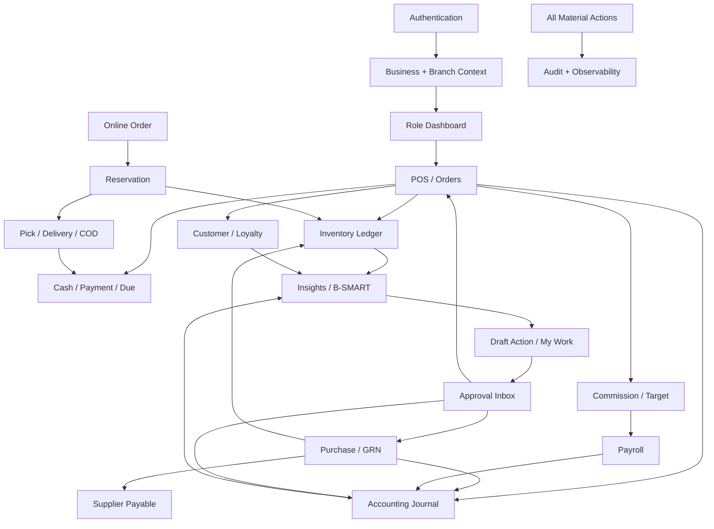

# B-SMART Business OS — Panel-wise Feature Catalogue

**Companion document:** `docs/BSMART_WORLD_CLASS_SRD.md`  
**Purpose:** Authentication থেকে platform administration পর্যন্ত কোন panel-এ কী থাকবে,
কারা ব্যবহার করবে এবং কোন module-এর সঙ্গে কীভাবে connect হবে—তার UI/functional blueprint।  
**Important:** এখানে `Target` লেখা capability requirement; existing menu/button থাকলেই
implemented ধরা যাবে না। Code-verified বর্তমান অবস্থা `docs/FEATURE_STATUS.md`-এ থাকবে।

---

## 1. Complete navigation tree

```text
PUBLIC
├── Landing
├── Features by Business Type
├── Pricing / Demo
├── Help / Security / Status
└── Authentication
    ├── Sign up
    ├── Verify Mobile/Email
    ├── Login / MFA
    ├── Password Recovery
    ├── Accept Staff Invite
    ├── Select Business
    └── Select Branch

ONBOARDING
├── Business Profile
├── Vertical Pack
├── Branch & Warehouse
├── Payment Methods
├── Product/Service Import
├── Opening Stock
├── Opening Cash/Bank/MFS
├── Customer/Supplier Opening Due
├── Staff Invite
├── Receipt Setup
└── Readiness Review

BUSINESS APP
├── Command Center
│   ├── Dashboard
│   ├── My Work
│   ├── Notification Center
│   ├── Universal Search
│   └── Approval Inbox
├── Sales
│   ├── POS
│   ├── Held Bills
│   ├── Sales History / Invoice
│   ├── Quotation
│   ├── Sales Order
│   ├── Return / Exchange / Void
│   ├── Sales Control
│   ├── Price Books
│   └── Recurring Orders
├── Inventory
│   ├── Stock Overview
│   ├── Product / Service Catalogue
│   ├── Variants & Units
│   ├── Stock Movement Ledger
│   ├── Batch & Expiry
│   ├── Serial / IMEI / Warranty
│   ├── Stock Count
│   ├── Transfer
│   ├── Damage / Quarantine
│   ├── Reorder Planner
│   └── Barcode / Label
├── Procurement
│   ├── Supplier Directory
│   ├── Purchase Request
│   ├── RFQ / Supplier Quotes
│   ├── Purchase Order
│   ├── Goods Receipt / QC
│   ├── Supplier Invoice / 3-Way Match
│   ├── Purchase Return / Claim
│   ├── Payable
│   └── Supplier Scorecard
├── Customer & CRM
│   ├── Customer Directory
│   ├── Customer 360
│   ├── Receivable / Credit Control
│   ├── Loyalty
│   ├── Campaign
│   ├── Lead / Pipeline
│   ├── Support Ticket
│   └── Feedback
├── Cash & Accounting
│   ├── Cashier Shift
│   ├── Payment Transactions
│   ├── Reconciliation
│   ├── Expense
│   ├── Collection / Settlement
│   ├── Chart of Accounts
│   ├── Journal / General Ledger
│   ├── Trial Balance
│   ├── Profit & Loss
│   ├── Balance Sheet / Cash Flow
│   ├── Period Close
│   └── VAT / Tax Center
├── Workforce
│   ├── Staff & Roles
│   ├── Roster
│   ├── Attendance
│   ├── Leave
│   ├── Target / Commission
│   ├── Payroll / Payslip
│   └── Performance
├── Order Fulfilment
│   ├── Channel Orders
│   ├── Reservation
│   ├── Pick & Pack
│   ├── Delivery Board
│   ├── Rider App
│   └── COD Handover
├── Intelligence
│   ├── Operational Insights
│   ├── Today's Actions
│   ├── B-SMART Recommendations
│   ├── Forecast
│   ├── Customer Segments
│   ├── AI Copilot
│   └── Model / Outcome Monitor
├── Reports
│   ├── Sales / Margin
│   ├── Stock / Expiry
│   ├── Purchase / Supplier
│   ├── Due / Collection
│   ├── Cash / Payment
│   ├── Staff / Payroll
│   └── Custom Scheduled Reports
└── Administration
    ├── Business / Branch / Warehouse
    ├── Roles & Permissions
    ├── Approval Rules
    ├── Integration Center
    ├── Document Templates
    ├── Import / Export
    ├── Audit Trail
    ├── Security Center
    ├── Backup / Restore
    ├── Feature / Vertical Packs
    └── Subscription / Billing
```

---

## 2. Authentication ও public panels

### Panel A01 — Landing Page

**Users:** Public visitor  
**Purpose:** B-SMART কী, কার জন্য এবং কী outcome দেয় তা বোঝানো।

**Sections**

- SME problem → product outcome hero; “শুরু করুন”, “ডেমো দেখুন”।
- ব্যবসার ধরন: pharmacy, grocery, fashion, wholesale, restaurant, electronics,
  service, manufacturing ইত্যাদি।
- Core feature tour, workflow animation, security/trust, pricing, FAQ।
- বাংলা/English toggle, support/contact এবং login link।
- কোনো invented customer count/review নয়; verified না হলে “demo” label।

**Connects:** Signup preselected vertical, pricing, help center, service status।

### Panel A02 — Sign-up

**Users:** New owner  
**Fields:** Full name, mobile, email, password/passkey, terms/privacy consent।

**Features**

- Bangladesh mobile normalization; email/mobile duplicate-safe check।
- Password strength, breached/common password rejection, show/hide password।
- Passkey registration option; verification channel selection।
- Rate limit, CAPTCHA/risk challenge only when needed।
- Pending account resume; duplicate click idempotent।

**Output:** Pending `User`; verification সফল হলে onboarding session।

### Panel A03 — Mobile/Email Verification

- Six-digit OTP input with paste/autofill; masked destination।
- Countdown, resend cooldown, remaining attempts এবং change-number flow।
- OTP hash, single-purpose, short expiry এবং consumed-once।
- Success → organization setup; repeated success does not duplicate account।

**Connects:** Identity, OTP provider, security event log।

### Panel A04 — Login

**Features**

- Mobile/email + password অথবা passkey।
- Remembered trusted device policy; “আমাকে মনে রাখুন” মানে দীর্ঘ session নয়।
- Failed attempt throttling; generic error যাতে account existence leak না করে।
- Suspended membership, deactivated user এবং locked account-এর পৃথক safe recovery path।
- New/high-risk device হলে MFA এবং notification।

**Output:** Rotating session → organization/branch selector বা role dashboard।

### Panel A05 — MFA Challenge / Setup

- WebAuthn/passkey preferred; TOTP QR + verification; recovery codes one-time view।
- Owner, platform admin, payroll approver, integration secret editor-এর mandatory MFA।
- Lost authenticator recovery identity-proofing; admin কখনো OTP দেখতে পারবে না।
- Recent-authentication timestamp sensitive action-এ পুনরায় challenge করবে।

### Panel A06 — Password Recovery

- Mobile/email entry; response account exists কি না reveal করবে না।
- One-time expiring recovery token; password history/policy check।
- Success হলে old refresh-token family revoke এবং user alert।
- “All devices logout” default; security event preserved।

### Panel A07 — Staff Invite Acceptance

- Business, inviter, intended role/branch এবং invite expiry দেখাবে।
- Existing account হলে login করে membership accept; নতুন হলে identity setup।
- Accept/decline; expired/revoked/already-used states।
- Role change invite link দিয়ে silently করা যাবে না।

### Panel A08 — Business Selector

- User-এর active memberships-এর business cards: name, logo, role, last access।
- Search, favorite/recent business; suspended business disabled reason।
- Selection server-issued tenant context সেট করবে; URL/local storage alone trusted নয়।

### Panel A09 — Branch/Workstation Selector

- Assigned branches এবং current open shift দেখাবে।
- Cashier-এর registered counter/device; manager-এর permitted branch switch।
- Branch switch-এ cached data, cart এবং unsynced operation safety warning।
- Selected branch global top bar-এ সবসময় visible।

### Panel A10 — Session & Device Management

- Current/other sessions: device, browser, approximate location/IP, last active।
- One session revoke, all-other-sessions revoke, trusted device remove।
- Password/MFA/role/security policy change-এর history।
- Unknown-login report → revoke + password reset flow।

---

## 3. Onboarding panels

### Panel O01 — Business Identity

- Trade/legal name, business type, logo, mobile, email, address, district/upazila।
- BIN/TIN/trade license fields optional/configurable; document metadata + expiry alert।
- Fiscal year, currency BDT, timezone Asia/Dhaka, default language।
- Save draft, progress indicator, resume on another device।

### Panel O02 — Vertical Pack Selection

- Business type → recommended capabilities preview।
- Product, service বা hybrid mode।
- Examples: pharmacy=batch/expiry; fashion=variant/exchange; restaurant=table/KDS/recipe।
- Pack later enable/disable impact এবং required data migration দেখাবে।

### Panel O03 — Branch & Warehouse Setup

- First branch code/name/address/hours; default warehouse and counter।
- Document number prefix; branch manager; inventory-sharing policy।
- Multi-branch owner additional branch যোগ করতে পারবে।
- Duplicate branch code এবং invalid document sequence blocked।

### Panel O04 — Payment Method Setup

- Cash, bKash, Nagad, Bangla QR, card, bank, due, COD capability toggles।
- Each method → accounting account/clearing account mapping।
- Provider mode `sandbox/live/not configured`; credential UI secret field নয়, secure reference।
- Test connection; live enable requires owner MFA।

### Panel O05 — Product/Service Setup

- Manual quick-add, template download, CSV/XLSX import।
- Column mapping, units, barcode, cost, sale price, tax, reorder, variant/batch flags।
- Validation preview: accepted/warning/rejected counts; error file।
- File checksum idempotency; commit summary and rollback before dependent transactions only।

### Panel O06 — Opening Stock

- Branch/warehouse, product/variant, quantity, unit cost, batch/expiry/serial।
- As-of business date এবং valuation total।
- Review → owner confirmation → stock movement + opening journal।
- Post-এর পরে direct edit নয়; stock adjustment panel ব্যবহার করতে হবে।

### Panel O07 — Opening Money & Due

- Cash drawer/safe, bank/MFS balance, customer receivable, supplier payable।
- Party mapping, reference, due date এবং opening date।
- Debits/credits preview; imbalance block।
- Post করার আগে summary confirmation ও downloadable record।

### Panel O08 — Staff Invite

- Name, verified contact, role template, branch, employment start date।
- Bulk invite, resend/revoke, pending/accepted status।
- Owner permission preview: selected role কী দেখতে/করতে পারবে।

### Panel O09 — Receipt & Test Transaction

- Logo, business identity, footer, return policy, print width, বাংলা font preview।
- Test print/WhatsApp preview; এটি real invoice number consume করবে না।
- First-sale walkthrough এবং undo-safe tutorial data reset।

### Panel O10 — Readiness Review

Checklist: branch, product/service, opening balance, staff, payment, receipt, backup destination,
security/MFA। Missing critical item block; optional item “Later” task হিসেবে My Work-এ যাবে।

---

## 4. Global application shell

### Panel G01 — Top Bar

- Business/branch/warehouse switcher।
- Universal search: barcode, SKU, invoice, customer, order, PO, job card।
- Online/offline badge; queued/syncing/conflict operation count।
- Quick create: Sale, Expense, Purchase, Customer, Stock Count।
- Notification, help, language, profile/session/logout।
- Permission অনুযায়ী result/action; hidden object search result-এও leak হবে না।

### Panel G02 — Sidebar

- “Daily Work”, Sales, Inventory, Purchase, Accounts, CRM, Workforce, Reports,
  Intelligence, Settings groups।
- Role + capability + branch permission থেকে server-aware menu।
- Badge: approval, low stock, expiring stock, pending payment, sync conflict।
- Favorites/recent; collapsed desktop ও accessible mobile drawer।

### Panel G03 — Notification Center

- Categories: action required, money, stock, staff, integration, system/security।
- Read/unread, mark all, snooze, assign, resolve; action deep-link।
- Severity এবং deadline; notification নিজে source-of-truth নয়।
- In-app → SMS/WhatsApp/email delivery attempts/status drill-down।

### Panel G04 — Universal Search

- Typeahead, barcode exact match, typo tolerant party/product search।
- Result grouped by type; recent search; advanced filter।
- Keyboard navigation; scanner input detection।
- Authorization ও tenant/branch scope before result indexing/return।

### Panel G05 — My Work

- “আমার approval”, “আজকের delivery/job/count”, “overdue follow-up”, “failed sync”।
- Priority, due time, assigned by, SLA; bulk complete শুধু safe actions-এ।
- Each card source document-এ opens; manual close reason audited।

---

## 5. Dashboard panels

### Panel D01 — Owner Executive Dashboard

**Cards:** today/month sales, gross margin, expense, cash position, receivable/payable,
inventory value, stockout/expiry risk, pending approvals।

**Widgets**

- Sales trend versus prior comparable period।
- Branch leaderboard with same-basis comparison।
- Cash/MFS/card reconciliation health।
- Top/slow/dead products; return/discount/void anomaly।
- Customer retention/credit risk; supplier delays।
- Click every number → filtered source report; `as of` time and freshness shown।

### Panel D02 — Manager Operations Dashboard

- Active shifts/counters, hourly sales, pending orders, pick/pack/delivery queue।
- Low stock, transfer wait, GRN/QC, staff attendance exception।
- Pending discount/refund/stock adjustment approvals।
- Branch-only access; cost/margin visibility separate permission।

### Panel D03 — Cashier Dashboard

- Shift status/opening time, quick POS, held bills, recent receipts।
- Cash/MFS/card tender totals, but blind-close policy হলে expected cash hidden।
- Pending offline sync/conflict এবং printer status।
- No purchase cost, profit, other cashier shift or unrestricted customer export।

### Panel D04 — Stock Keeper Dashboard

- Today receiving, transfers, count tasks, low stock, expiring/quarantine।
- Scan shortcuts; warehouse context; finance/margin hidden।

### Panel D05 — Accountant Dashboard

- Unreconciled tenders, due collection/payment, overdue invoices, expenses pending evidence।
- Unposted/failed journals, trial balance imbalance alert, close checklist।

### Panel D06 — Staff/Rider/Technician Dashboard

- Own roster/attendance, assigned jobs/deliveries, target/commission estimate, alerts।
- অন্য employee-এর salary/customer list বা unassigned job নয়।

---

## 6. Sales panels

### Panel S01 — POS (`/sales` current route)

**Header:** branch, counter, cashier shift, online/sync state, customer, price book।

**Main features**

- Barcode/camera/search; variant, unit, batch/FEFO ও serial selection।
- Cart quantity, discount, tax, promotion, line note; keyboard/touch shortcuts।
- Available stock live; offline snapshot age warning।
- Customer selection/create, loyalty balance/redeem, credit available।
- Hold/resume bill; quotation/order থেকে load।
- Cash, MFS, card, bank, due, gift/loyalty and split tender।
- Server-calculated total; rounding, VAT/tax breakdown।
- High discount, price override, credit exceed → approval request।
- Complete → invoice, stock issue, payment/due, journal, loyalty, commission, audit।
- Print/share/download receipt; failed printing does not reverse sale।

### Panel S02 — Held Bills

- Server-held এবং device-local drafts আলাদা badge।
- Owner/cashier, created time, items, amount, version, expiry।
- Resume, transfer to another authorized counter, cancel with reason।
- Stale price/stock on resume revalidation; no stock reservation unless configured।

### Panel S03 — Sales History (`/sales-history`)

- Search/filter: invoice, date, cashier, customer, tender, status, channel।
- Invoice detail: snapshot items/prices/taxes/tenders, journal, stock movement, audit timeline।
- Reprint/share count; create return/exchange/void subject to permission।
- No direct edit/delete of posted invoice।

### Panel S04 — Quotations (`/orders` target tab)

- Customer, expiry, item/service, price book, terms, notes, attachments।
- Draft/version/send/accept/reject/expire; PDF/WhatsApp/email।
- Convert accepted quotation → sales order without retyping; price/stock revalidate।
- Quotation does not reduce stock or post accounting।

### Panel S05 — Sales Orders

- Channels: counter, phone, social, website/API, representative।
- Status, deposit/payment, requested delivery, fulfilment branch, address।
- Reserve/release stock, partial fulfil, cancel/backorder।
- Convert fulfilled lines → invoice exactly once।

### Panel S06 — Return / Exchange (`/returns`)

- Original invoice lookup; line-wise returnable balance।
- Reason, condition, restock/quarantine/write-off, batch/serial confirmation।
- Refund original method/cash/due adjustment/store credit; threshold approval।
- Exchange = return + new sale, linked and net payable/refundable।
- Stock, COGS, revenue/tax, loyalty and commission clawback/reversal।

### Panel S07 — Void & Sales Control

- Pending/successful void, discount, manual price and duplicate/fraud flags।
- Void requires reason, permission, recent auth and refund approval policy।
- Posted sale never disappears; reversing documents and audit remain।
- Exception filters by cashier/branch/rate/value/time।

### Panel S08 — Price Books & Promotions

- Retail, wholesale, customer group, branch, channel and effective date।
- Quantity tiers, bundles, coupon, buy-X-get-Y, minimum margin guard।
- Priority/stacking simulator; future schedule and approval।
- Historical invoice stores applied rule version/snapshot।

### Panel S09 — Recurring Sales

- Customer subscription, items/services, frequency, start/end, payment policy।
- Generate draft order, notify, pause/skip/cancel; failed payment exception।
- No automatic charge without valid provider mandate/consent।

---

## 7. Inventory ও catalogue panels

### Panel I01 — Product/Service Catalogue (`/products`)

- Product/service, SKU, barcode, category/brand, images, active state।
- Purchase/sale/base unit, conversion, cost, retail/wholesale, tax, reorder।
- Track batch/expiry/serial/warranty/weight/variant flags।
- Supplier link, preferred supplier, lead time, pack/MOQ।
- Duplicate SKU/barcode validation; deactivate blocked/warned by open documents।
- Cost/profit columns permission-protected।

### Panel I02 — Variant & Unit Matrix

- Style/template → size, color, material variants; barcode per variant।
- Box/strip/piece or carton/unit conversion using integer base unit।
- Effective conversion changes cannot rewrite historical movement।
- Variant-level stock, price and reorder।

### Panel I03 — Stock Overview (`/inventory`)

- On-hand, reserved, available, quarantine, in-transit by branch/warehouse।
- Low/out/overstock filters; valuation optional permission।
- Stock card drill-down; quick transfer/count/adjust/request purchase।
- Balance is movement-ledger projection, not editable number।

### Panel I04 — Stock Movement Ledger

- Receipt, sale issue, return, transfer, adjustment, production, damage movements।
- Product/location/lot/serial/date/reference filters।
- Opening/running/closing quantity and value; source document link।
- Immutable; correction uses reversal/adjustment।

### Panel I05 — Batch & Expiry (`/expiry`)

- Batch/lot, received/manufactured/expiry date, quantity, cost, supplier।
- Buckets: expired, 0–30, 31–60, 61–90, safe; money at risk।
- FEFO allocation; quarantine/recall; supplier claim/create markdown task।
- Batch merge forbidden unless identity/expiry same and policy permits।

### Panel I06 — Serial/IMEI & Warranty

- Unique serial scan at GRN, transfer, sale, return, repair and replacement।
- Current location/owner/status/warranty timeline।
- Duplicate/previously-sold serial hard stop; override not allowed, investigate।
- Warranty claim/job card link।

### Panel I07 — Stock Count (`/stock-count`)

- Full/cycle/spot count; location/category/ABC scope।
- Snapshot/freeze policy, blind count, scanner/manual entry।
- Recount, variance value/reason; counter cannot self-approve if maker-checker enabled।
- Approval posts adjustment movement and accounting; original count retained।

### Panel I08 — Stock Transfer

- Source/destination, requested quantity, picker, transporter, expected date।
- Request → approve → pick → dispatch → partial/full receive → close।
- Dispatch creates in-transit; receive destination stock; discrepancy claim।
- Batch/serial scan both ends; proof/attachment।

### Panel I09 — Damage / Quarantine / Write-off

- Reason, source document, product/batch/serial, photo/evidence।
- Move sellable → quarantine; inspect → release/return/write-off।
- Write-off approval and expense journal; supplier claim link।

### Panel I10 — Reorder Planner (`/reorder`)

- Stock, reserved, sales velocity, lead time, safety stock, days cover, MOQ/pack।
- Suggested quantity/cost, budget cap and explanation।
- Select/modify → Purchase Request or draft PO; never silently place order।
- Accepted B-SMART recommendation links to actual purchase/outcome।

### Panel I11 — Barcode & Label

- Product/batch/price label templates; quantity and print preview।
- EAN/internal barcode validation; duplicate warning।
- Printer configuration/test; reprint audit।

---

## 8. Purchase ও supplier panels

### Panel P01 — Supplier Directory (`/directory` supplier tab)

- Legal/trade name, contact, address, tax data, terms, lead time, bank/MFS destination।
- Products/price history, open PO, payable, return/claim, performance।
- Sensitive payment destination change → MFA + approval + notification।

### Panel P02 — Purchase Request

- Requested by/branch/warehouse, items, quantity, need-by, reason, budget/project।
- Suggested source from reorder/production/manual।
- Draft → submit → approve/reject; approved request remaining quantity tracked।

### Panel P03 — RFQ & Quote Comparison

- Send one request to selected suppliers; deadline and terms।
- Capture price, tax, freight, MOQ, lead time, validity and attachments।
- Landed-cost comparison, supplier score, award rationale।
- Winning quote → PO; non-winners closed/notified।

### Panel P04 — Purchase Order (`/purchases`)

- Supplier, delivery branch/warehouse, lines, units, tax/discount/freight, expected date।
- Amount/budget threshold approval; issue/share PDF।
- Draft/approved/issued/partial/received/closed/cancelled states।
- Material change after approval creates new version/reapproval।

### Panel P05 — Goods Receipt (GRN)

- PO remaining lines; actual accepted/rejected quantity।
- Batch/expiry/serial, unit cost/freight allocation, warehouse/bin, QC।
- Partial receipts; over-receipt tolerance/approval।
- Post → stock movement + payable/accrual posting + supplier metric।

### Panel P06 — Supplier Invoice & 3-Way Match

- Supplier invoice number/date/amount/tax/evidence; duplicate detection।
- Compare PO ordered vs GRN accepted vs invoice billed।
- Quantity/price/tax/freight variance with configured tolerance।
- Match → payable approved; exception → resolution/credit note/approval।

### Panel P07 — Purchase Return / Supplier Claim (`/purchase-returns`)

- Source PO/GRN/batch, reason, quantity, value, replacement/refund/credit request।
- Submit → dispatch → supplier acknowledge → settle/replace/reject।
- Outbound stock, debit note/payable adjustment and replacement receipt linked।

### Panel P08 — Supplier Payable

- Ageing buckets, due date, invoice/credit/debit, disputed balance।
- Payment proposal/batch, partial allocation, withholding/fee, reference।
- Payment approval → treasury/accounting; remittance advice।

### Panel P09 — Supplier Scorecard

- On-time delivery, fill rate, rejection/defect, price variance, claim resolution।
- Period/category/branch compare; underlying documents drill-down।
- Score is explainable; manual rating separated from computed metrics।

---

## 9. Customer ও CRM panels

### Panel C01 — Customer Directory (`/directory` customer tab)

- Name, mobile, email, addresses, type/segment, assigned representative।
- Consent per channel/purpose; credit term/limit; loyalty status।
- Duplicate detection/merge with audit; anonymous walk-in remains possible।
- PII reveal/export separate permission।

### Panel C02 — Customer 360

- Lifetime/recent sales, returns, margin permission, dues, collections, loyalty।
- Orders/deliveries, campaigns/messages, support/jobs and notes timeline।
- Next actions and risk flags; every KPI source drill-down।

### Panel C03 — Receivable & Credit Control (`/accounts`)

- Outstanding/overdue ageing, invoice allocation, promises and dispute।
- Credit available = limit − outstanding − committed orders।
- Collect cash/MFS/bank; receipt and journal।
- Credit hold/release, limit increase approval, bad debt write-off।

### Panel C04 — Loyalty

- Earn/redeem rate, tiers, expiry, cap and excluded products।
- Append-only points ledger; sale earn, return clawback, manual adjustment approval।
- Balance at POS/Customer 360; liability/revenue accounting policy।

### Panel C05 — Campaigns

- Audience builder from consented customers; segment/filter estimate।
- Approved template, schedule, frequency cap, opt-out suppression।
- SMS/WhatsApp/email outbox and delivery status; conversion attribution।
- AI can draft copy/audience, human approves send।

### Panel C06 — Leads & Pipeline

- Lead source, owner, activity, need, value, probability, next follow-up।
- Stages lead → qualified → quote → won/lost; won creates customer/order।
- Overdue tasks and reasoned loss analysis।

### Panel C07 — Support Tickets

- Customer/order/invoice/product/job link; category, priority, SLA, assignee।
- Conversation, attachment, internal note, escalation and resolution।
- Refund/return action via respective authorized workflow, not direct ticket mutation।

### Panel C08 — Feedback

- Post-sale/delivery survey, rating/NPS-style feedback, consent।
- Low score auto-ticket/task; response dashboard।
- Public review prompt policy; no fabricated rating।

---

## 10. Cash, payment ও accounting panels

### Panel F01 — Cashier Shift (`/cash` expanded target)

- Open shift with denomination-counted float; registered counter/device।
- During shift: cash sale/refund, cash-in/out, safe drop, COD receipt।
- Tender summary; cashier’s own event timeline।
- Blind closing count; expected vs actual; variance reason/approval।
- Close/reopen/suspend/handover states; no overlapping forbidden shift।

### Panel F02 — Payment Transactions

- Payment intent/attempt/provider reference/amount/channel/status।
- Pending/failed/success/cancelled/refunded timeline।
- Verify/query/retry safe actions; client screenshot cannot mark success।
- Invoice/order/refund/settlement links and webhook raw-event metadata।

### Panel F03 — Reconciliation

- Cash: shift expected vs count।
- MFS/card: successful transactions vs provider settlement/fee।
- Bank: imported statement vs internal receipt/payment।
- Auto-match confidence + manual match; split/many-to-one support।
- Difference, pending age, evidence, approver; period-close gate।

### Panel F04 — Expenses (`/accounts` expense tab)

- Date, category/account, amount/tax, branch/cost center, vendor, payment method।
- Receipt attachment, recurring flag, allocation and approval threshold।
- Draft/pending/approved/paid/rejected/reversed।
- Post expense/payable/cash journal and audit।

### Panel F05 — Collection & Supplier Settlement

- Party, invoices, amount, method, provider/bank reference, date।
- Suggested FIFO/manual allocation; overpayment creates advance/credit policy।
- Receipt/remittance; reverse via approved reversal, not delete।

### Panel F06 — Chart of Accounts

- Account code/name/type/subtype, parent, normal balance, system/manual flag।
- Activate/deactivate; account with history cannot delete।
- Default mapping for sales, tax, inventory, COGS, payment, variance, payroll।
- Mapping change effective-dated and approved।

### Panel F07 — Journal & General Ledger

- System/manual journal list; source document, date, period, debit/credit।
- Manual balanced journal with evidence and approval।
- Reverse and adjusting entry; posted line edit/delete prohibited।
- Account ledger running balance and source drill-down।

### Panel F08 — Financial Statements (`/accounting`)

- Tabs: Trial Balance, P&L, Balance Sheet, Cash Flow।
- Date/period, branch/consolidated, comparison and drill-down।
- Export PDF/CSV/XLSX permission; report basis/freshness shown।
- Trial balance must always balance; report totals journal-derived।

### Panel F09 — Period Close

- Checklist: bank/MFS/cash reconcile, GRN/invoice, depreciation/accrual, stock variance, payroll।
- Soft close → review → hard close; closed date blocks backdated posting।
- Reopen requires owner/MFA/approval/reason; complete audit।

### Panel F10 — VAT / Tax Center

- Effective-dated tax codes/rates; sales/purchase registers and adjustment।
- Invoice sequence/gap report; output vs input tax reconciliation।
- NBR-compatible export only after current rule validation; submission status/evidence।
- Tax config changes cannot recalculate posted historical invoice।

---

## 11. Approval, audit ও risk panels

### Panel W01 — Approval Inbox (`/approvals`)

- My pending, requested by me, completed, delegated, expired।
- Types: discount, refund/void, expense, purchase, stock adjustment, credit limit,
  supplier payment destination, payroll, period reopen।
- Request card: business impact, before/after, documents, requester, rule/SLA।
- Approve/reject/request-change; reason; MFA where required।
- Approval after underlying data changed → revalidate/reapproval।

### Panel W02 — Approval Rule Builder

- Document/action, amount/percentage/risk/branch/requester-role conditions।
- One/multi-level approvers, escalation, expiry, maker-checker।
- Simulation: sample action কোন rule hit করবে।
- Draft/publish/version/rollback; future effective date।

### Panel W03 — Audit Trail (`/audit`)

- Actor, action, resource, organization/branch, device/IP, time, outcome।
- Before/after safe diff, reason, approval, correlation ID।
- Filter/export permission; sensitive value redaction।
- Audit append-only; support/platform accessও recorded।

### Panel W04 — Risk & Exception Center

- Excessive discount/return/void, duplicate provider ref, negative stock attempt,
  unusual login/export, settlement difference, serial conflict।
- Severity, owner, SLA, evidence, linked transaction, resolve/escalate।
- Rule-based flag clearly separated from proven fraud।

---

## 12. Workforce panels

### Panel H01 — Staff & Roles (`/staff`)

- Staff profile, contact, employment state, branch, manager, job title।
- Role/permission/branch assignment; invite/resend/revoke/deactivate।
- Effective date and history; owner-last-admin safety guard।
- Salary and personal document tabs separately permission-protected।

### Panel H02 — Roster

- Week/month calendar, branch/station/shift, break and substitute।
- Availability/leave/maximum-hour conflicts; copy schedule।
- Publish/change notification; historical schedule snapshot।

### Panel H03 — Attendance

- Check-in/out/break; device/location policy; today status।
- Late/early/overtime/missing punch exceptions।
- Staff correction request; manager adjustment preserves original।
- Approved attendance → payroll input।

### Panel H04 — Leave

- Effective-dated leave policy, balance, calendar and holiday।
- Request dates/reason/attachment/substitute; manager/HR approval।
- Balance and roster impact; cancel/recall and payroll handling।

### Panel H05 — Target & Commission

- Target by person/team/branch/product/category/collection period।
- Commission rule basis: sale, margin, collection or return-window-complete।
- Progress and projected payout; eligible transaction drill-down।
- Return/void clawback; historical rule version immutable।

### Panel H06 — Payroll

- Pay period, eligible staff, base salary, attendance/overtime, commission, bonus,
  advance/deduction, net pay।
- Draft → calculate → review → approve → pay → lock।
- Change input → new calculation version; maker-checker।
- Payment batch and accounting journal; failed payment exception।

### Panel H07 — Payslip & Staff Self-service

- Private payslip breakdown/download, leave balance/request, attendance correction,
  roster and commission details।
- Staff sees only own data unless authorized manager।

### Panel H08 — Performance

- Goals with measurable metric, check-in, feedback, training/action plan।
- Sales/attendance data context, not automatic disciplinary decision।
- Private access and retention policy।

---

## 13. Online order, fulfilment, rider ও COD panels

### Panel E01 — Channel Orders

- Website/social/manual/API orders in canonical queue।
- Customer/address/channel/payment/risk/stock status।
- Confirm/cancel/hold; duplicate external-order ID idempotency।
- Prepaid verification or COD eligibility before reservation।

### Panel E02 — Reservation Board

- Orders waiting/allotted/expiring/short; branch/warehouse allocation।
- Reserve exact product/variant/batch/serial; expiry countdown।
- Move allocation, partial/backorder/substitute approval; cancel releases once।

### Panel E03 — Pick & Pack

- Wave/pick list by location; scanner verifies item/quantity/lot।
- Short/damaged/wrong item exception; substitute authorization।
- Pack size/weight, package barcode/seal, invoice/challan and handoff।

### Panel E04 — Delivery Board

- New/assigned/picked/out/delivered/failed/RTO status columns।
- Zone/slot/rider/courier, route, contact, COD amount, SLA।
- Assignment/reassignment audit; customer notification।

### Panel E05 — Rider App

- Own assigned stops, optimized order/map deep-link, call masked where possible।
- Pickup scan, out-for-delivery, OTP/signature/photo proof, failed reason/retry।
- Cannot edit item/price/payment; offline status queue with time/location policy।

### Panel E06 — COD Handover

- Rider expected delivered-COD, submitted denomination, shortage/excess।
- Rider submits → cashier counts → both acknowledge → manager exception approval।
- Clears rider receivable and adds cash custody/journal exactly once।

### Panel E07 — Return-to-Origin

- Failed delivery reason, physical return scan, item condition, restock/quarantine।
- Reservation/order/payment/refund and delivery cost adjustments linked।

---

## 14. Reports ও analytics panels

### Panel R01 — Report Center (`/reports`)

- Catalogue: sales, margin, returns, tax, stock, valuation, movement, expiry,
  purchase, supplier, receivable/payable, cash/payment, staff/payroll।
- Date/business/branch/warehouse/category/party/channel filters।
- Saved view, compare period, permission-aware columns, drill-down।
- CSV/XLSX/PDF/print; large export async with expiry and audit।

### Panel R02 — Scheduled Reports

- Report + saved filter + recipient + frequency + channel।
- Preview, permission evaluated at generation time, delivery history।
- Sensitive report cannot go to unverified recipient/public link।

### Panel R03 — Operational Insights (`/insights`)

- ABC/XYZ, days of cover, dead stock, price/cost change, cash locked, margin leak।
- Each insight formula, data window and source rows।
- “Take action” creates task/request/draft document; not invisible mutation।

### Panel R04 — Today's Actions (`/strategy`)

- Prioritized low stock, collection, expiry, supplier delay, reconciliation exceptions।
- Owner/assignee/deadline; accept/snooze/dismiss with reason।
- Deterministic rule vs AI recommendation label।

### Panel R05 — B-SMART Recommendations (`/bsmart-actions`)

- Reorder, expiry, retention or supported action cards।
- Why, supporting numbers, confidence, constraints and expected impact।
- Accept/reject/modify/defer; accepted action linked to actual PO/task/campaign।
- Outcome auto/manual measurement and benefit review।

### Panel R06 — Forecast (`/forecast`)

- Product/category/branch demand horizon, baseline vs selected model।
- Historical/forecast intervals, data sufficiency, error metrics।
- Forecast can inform reorder; cannot directly change stock/order।

### Panel R07 — Customer Segments (`/segments`)

- Explainable segment definitions, counts/value/behavior and consent-safe audience।
- Customer drill-down permission; campaign draft creation।
- Segment calculation time/version shown।

### Panel R08 — AI Copilot

- Natural Bangla/English questions with suggested prompts।
- Role/tenant/branch-scoped tool access; answer citations to internal documents।
- Data period, calculation and limitation shown।
- Can create drafts; post/pay/send/delete requires explicit human confirmation/permission।
- Conversation history retention/delete policy; no secrets in prompts।

### Panel R09 — Model & Outcome Monitor

- Model/version/data cutoff, evaluation, drift, coverage and fallback status।
- Recommendation adoption and measured business outcome।
- Promote/rollback/disable permission; scientific research metrics separated from live tenant KPI।

---

## 15. Settings ও administration panels

### Panel X01 — Business Profile (`/setup`)

- Business/legal identity, contacts, address, sector, locale, fiscal year, branding।
- Tax/document metadata; change history।
- High-impact legal identity change approval/MFA।

### Panel X02 — Branch / Warehouse / Counter

- Branch code/name/location/hours; warehouse/bin; counters/devices।
- Managers, operation flags, document sequence, transfer route।
- Deactivate only after open shift/order/stock/dependent task resolution।

### Panel X03 — Roles & Permissions

- Default role templates and custom roles।
- Domain/action matrix, branch scope, sensitive permissions, user preview।
- Copy/version; separation-of-duty warning; last-owner guard।
- Server-side enforcement required; sidebar visibility follows it।

### Panel X04 — Integration Center

- Providers grouped: Payment, SMS, WhatsApp, Email, Accounting/Tax, Hardware, Commerce।
- State: unavailable/not configured/sandbox/live/degraded।
- Credential reference/masked identifier, test, webhook URL/signing status, last success/error।
- Logs/retry/dead-letter; owner MFA for connect/rotate/disconnect/live enable।
- Provider credentials legal merchant account থেকে; internet থেকে অন্যের credential নয়।

### Panel X05 — Notification Template

- Event, channel, language, subject/body, approved variables, preview/test।
- Version/publish/rollback; provider template approval state।
- Consent/frequency/quiet-hours policy।

### Panel X06 — Document & Print Templates

- Quote/order/challan/invoice/receipt/GRN/PO/payslip।
- A4/thermal, বাংলা font, logo, tax/return/footer fields।
- Live sample preview; versioned template snapshot on issued documents।

### Panel X07 — Import Center (`/import`)

- Import type, template, upload, column mapping, validation, preview, commit।
- Per-row result/error file; checksum, actor, counts and provenance।
- Safe rollback only when no dependent transaction; otherwise correction workflow।

### Panel X08 — Export & Data Request

- Data set/scope/date/format; estimate and reason।
- Large export background job; encrypted artifact, expiry and download audit।
- PII/finance export permission + step-up authentication।

### Panel X09 — Security Center

- MFA/passkeys, sessions/devices, password/security policy, login events।
- IP/network policy optional, API keys, webhook secrets and rotation।
- Suspicious-event alerts; emergency revoke।
- Secrets never displayed again after creation।

### Panel X10 — Backup & Restore

- Last successful/failed backup, age, size/checksum, off-device location status।
- Manual backup request; restore only controlled environment/authorization।
- Quarterly restore-drill result, RPO/RTO and reconciliation report।

### Panel X11 — Feature / Vertical Packs

- Enabled/available pack, dependency, data migration, menu preview।
- Enable → setup checklist; disable blocked by active specialized records/workflow।
- Feature flags per organization/branch with audit and rollback plan।

### Panel X12 — Subscription & Billing

- Plan, active users/branches/storage/usage, invoices, payment method।
- Upgrade/downgrade impact; grace/read-only/export policy।
- Subscription failure never silently deletes business data।

### Panel X13 — Developer/API

- Scoped API keys/service accounts, allowed branch/event, rate limit and expiry।
- Webhook subscription, signing secret, test payload, delivery history/retry।
- OpenAPI/docs; key rotation/revoke; complete audit।

### Panel X14 — Help & Guide (`/guide`)

- Role-aware panel explanations, searchable tasks, videos/screenshots and shortcuts।
- Contextual “এই page কী করে?”; support ticket with safe diagnostic metadata।
- App version, known incident/status link; secrets excluded from diagnostics।

---

## 16. Vertical-specific panels

### Panel V01 — Restaurant Floor & Table

- Floor/table map, available/occupied/reserved/cleaning; guest/count/waiter।
- Open table order, transfer/merge/split, reservation/no-show।
- Connects: menu/POS → kitchen ticket → recipe stock → bill/payment।

### Panel V02 — Kitchen Display (KDS)

- New/accepted/preparing/ready/served; station routing and elapsed-time SLA।
- Modifier/allergy note (operational, medical advice নয়), recall/re-fire reason।
- Cancelled prepared item → wastage approval; payment state independent।

### Panel V03 — Recipe & Food Cost

- Recipe version, yield, ingredient/unit, prep batch, substitute, waste।
- Menu sale consumes ingredient; theoretical vs actual food cost।

### Panel V04 — Manufacturing BOM & Production

- BOM/version/routing/work center; production plan/order।
- Material reservation/issue, WIP, labor/overhead, QC, scrap/by-product।
- Completion → finished stock and journal; planned vs actual variance।

### Panel V05 — Service Job Card

- Intake, item/device/serial/photos, symptom, diagnosis note, estimate/customer approval।
- Technician/status/time, parts issue/return, outsource, QC, delivery।
- Labor + parts invoice, warranty/rework history।

### Panel V06 — Electronics Serial & Warranty

- IMEI/serial lifecycle, activation/customer/warranty, DOA/claim/replacement।
- Sale/return/job card/supplier claim all linked to exact serial।

### Panel V07 — Fashion Collection & Variant

- Style/collection/season, size-color matrix, variant barcode, look/image।
- Sell-through by size/collection, exchange and alteration job।

### Panel V08 — Salon Appointment & Membership

- Staff/resource calendar, service duration, deposit, waitlist/no-show।
- Package/membership usage, product consumption, staff commission, rebooking।

### Panel V09 — Education Student & Fee

- Student/guardian, batch/course/class, attendance, fee plan/installment, collection due।
- Teacher schedule and result/report only if pack scope includes it।

### Panel V10 — Transport/Delivery Trip & Fleet

- Shipment/trip/route/vehicle/driver, pickup/delivery proof, COD, fuel/maintenance।
- Capacity and status; accounting and customer invoice link।

### Panel V11 — Rental Asset Calendar

- Asset/kit availability, booking, deposit, pickup/return checklist।
- Late/damage fee, maintenance block, condition photos and settlement।

---

## 17. Platform administration panels

### Panel Z01 — Platform Overview (`/platform` current base)

- Tenant/user/branch health counts, service error/latency, outbox/webhook/backup health।
- Subscription/usage and recent incidents; no tenant financial details by default।

### Panel Z02 — Tenant Support

- Organization configuration/health, safe diagnostics, migration/integration state।
- Support access request with tenant approval, reason, expiry and visible audit।
- Silent impersonation or unrestricted data browsing forbidden।

### Panel Z03 — Provider Operations

- Provider availability/error/latency, sandbox/live aggregate, webhook backlog, retry queue।
- No credential plaintext; tenant-isolated delivery details।

### Panel Z04 — Security Operations

- Suspicious auth/API/export events, dependency/security scan, incident cases।
- Account/tenant containment action requires high privilege/MFA/two-person approval policy।

### Panel Z05 — Release & Feature Control

- Application version, migrations, tenant rollout/canary, feature flags, rollback।
- Change owner, reason, schedule, metrics and incident link।

---

## 18. Role-wise default home and menu

| Role | Default landing | Visible primary panels |
|---|---|---|
| Owner | Executive Dashboard | all authorized modules, security/settings |
| Manager | Operations Dashboard | sales, stock, purchase, approval, branch reports |
| Cashier | Cashier Dashboard/POS | own shift, POS, held bills, receipt, customer lookup |
| Stock Keeper | Stock Dashboard | catalogue read, GRN, stock, count, transfer, expiry |
| Procurement | Purchase Dashboard | supplier, PR/RFQ/PO/GRN/claim |
| Accountant | Finance Dashboard | collection/payment, expense, reconciliation, accounting/report |
| Sales Rep | My Work/Orders | customer, lead, quotation/order, collection, own target |
| HR/Admin | Workforce Dashboard | staff, roster, attendance, leave, payroll scope |
| Technician | Assigned Jobs | job cards, parts, time, QC/status |
| Rider | Assigned Deliveries | pickup, route, proof, COD handover |
| Kitchen/Production | Station Queue | KDS or production work orders only |
| Auditor | Audit/Reports | read-only permitted reports and audit |
| Platform Admin | Platform Overview | platform health/support/security; tenant role নয় |

---

## 19. Universal behavior every panel must have

1. **Permission:** Page, field, action এবং API—চার স্তরে permission।
2. **Scope:** Current business/branch/warehouse সবসময় visible এবং server-validated।
3. **States:** Loading, empty, partial, success, validation, permission denied, offline, conflict,
   provider failed and retry state।
4. **Lists:** Search, filter, sort, pagination, saved view and accessible table/card mobile view।
5. **Forms:** Required/help/error, unsaved-change warning, duplicate-submit protection।
6. **Money/time:** BDT fixed-decimal, business date এবং exact timestamp; timezone explicit।
7. **Audit:** Material create/update/approve/reverse/export/config action logged।
8. **Documents:** Issued snapshot immutable; reprint/download actor recorded।
9. **Accessibility:** Keyboard, focus, labels, contrast, target size and Bangla overflow।
10. **Help:** Contextual explanation and source workflow; technical error has correlation ID।
11. **Offline:** Capability clearly declared; unsupported action disabled with reason, fake success নয়।
12. **Integration:** External provider state canonical; retry/idempotency and last verified status visible।

---

## 20. Most important panel connections



### Connection rules

- POS manually stock কমাবে না; it commands Sales, which creates Inventory movement।
- Dashboard নিজে হিসাব রাখবে না; source ledgers/read models থেকে হিসাব দেখাবে।
- Approval business action নয়; approval-এর পর command আবার validate হয়ে execute হবে।
- AI কোনো financial/stock table সরাসরি লিখবে না; approved draft/action command ব্যবহার করবে।
- Notification transaction commit-এর পর outbox থেকে যাবে; provider failure sale rollback করবে না।
- Report source document পর্যন্ত drill-down করবে; copied total আলাদা table-এ authoritative হবে না।

---

## 21. Panel completion checklist

একটি panel production-complete বলার আগে:

- correct role দিয়ে happy path চলে;
- forbidden role/other tenant/other branch access fails;
- every button has working backend or clearly disabled reason;
- stock/money/journal/downstream impact reconciles;
- duplicate click/retry does not duplicate effect;
- validation, empty, error, offline এবং conflict UI আছে;
- audit event, monitoring and correlation ID আছে;
- বাংলা/English, mobile, keyboard and print state tested;
- unit/integration/E2E tests এবং real user acceptance pass;
- help text and operating runbook updated।

এই checklist pass না করলে panel সুন্দর দেখালেও feature complete নয়।
