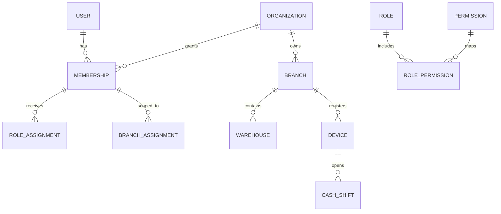
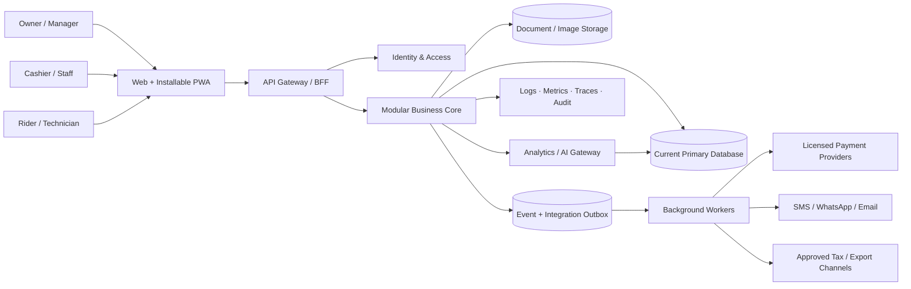
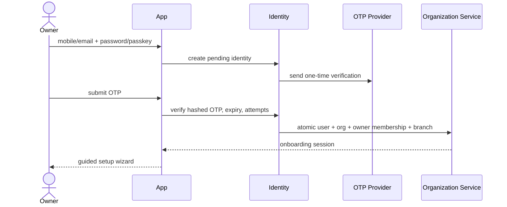
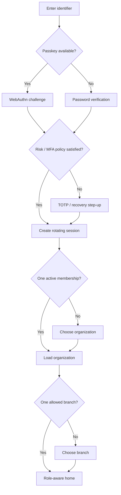
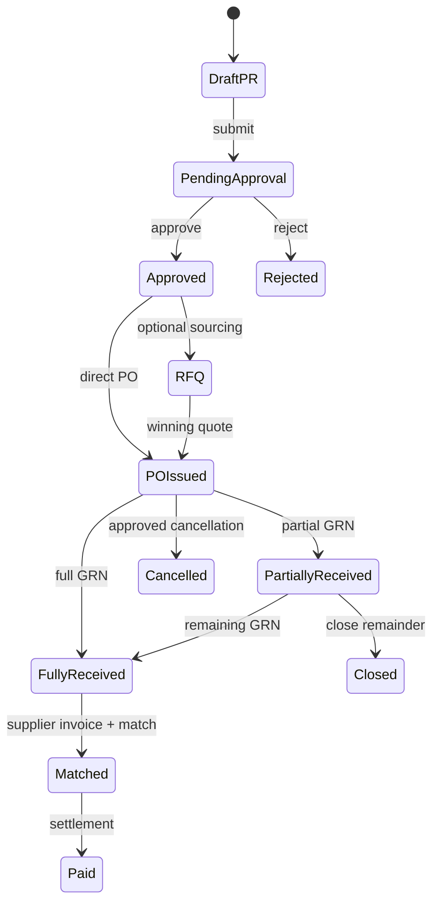
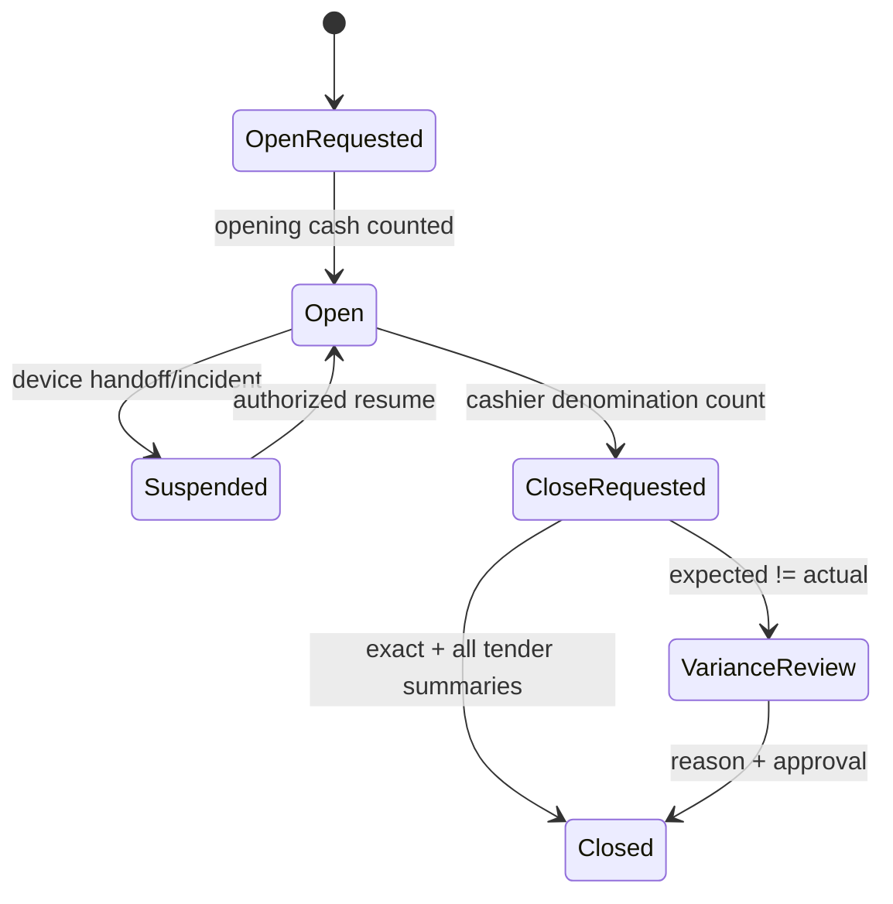
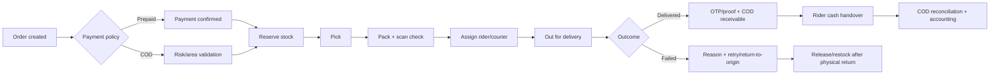
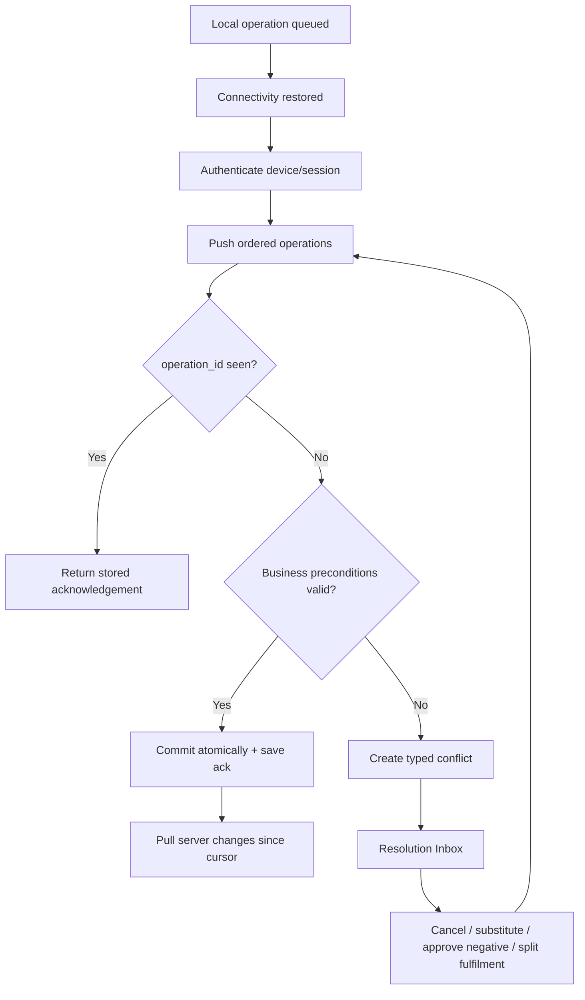
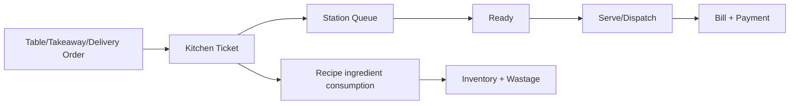
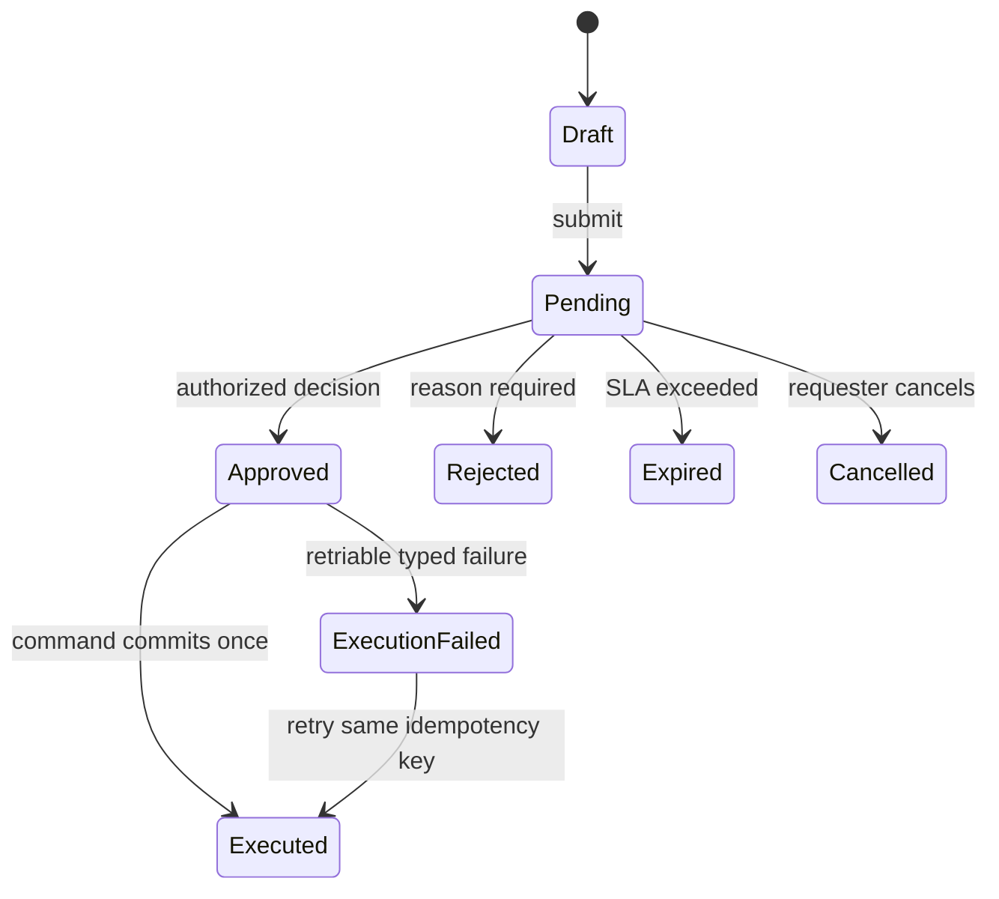

# AI Powerd Business Analytics System — World-Class Software Requirements Document (SRD)

**Document ID:** BSMART-SRD-001  
**Version:** 1.0  
**Status:** Target product specification (implementation claim নয়)  
**Primary market:** বাংলাদেশের micro, small ও medium enterprise (SME)  
**Languages:** বাংলা-first, English optional  
**Baseline database:** বর্তমান repository-র database ও schema; পরিবর্তন additive migration-এ  
**Last reviewed:** 30 September 2026

> এই নথি product vision, business rules, screen catalogue, permissions, data model,
> integration contract, security, operational quality এবং acceptance criteria—সবকিছুর
> একক source of truth। কোনো feature menu-তে দেখা গেলেই “complete” নয়; সংশ্লিষ্ট
> requirement, permission, audit, error handling এবং acceptance test pass করলেই complete।

---

## 1. Executive vision

B-SMART একটি সাধারণ POS নয়। এটি হবে একটি **modular SME Business Operating System**:
একটি shared core—Identity, Sales, Inventory, Procurement, Accounting, CRM, Workforce,
Workflow, Reporting, Integration ও Audit—এর উপর business-specific capability pack।

একজন মালিক signup করার পর একই দিনে:

1. প্রতিষ্ঠান ও branch তৈরি করবেন;
2. opening cash, stock, customer/supplier due আনবেন;
3. staff-কে role ও branch দেবেন;
4. sale/purchase/expense শুরু করবেন;
5. প্রতিটি transaction-এর stock, cash, due ও journal impact স্বয়ংক্রিয় পাবেন;
6. দিন শেষে cash/MFS/card মিলিয়ে shift close করবেন;
7. ব্যতিক্রম, approval, audit এবং actionable insight দেখবেন।

### 1.1 Product principles

- **One transaction, one truth:** Sale একবার post হলে invoice, payment, receivable,
  stock movement, loyalty, commission ও accounting একই atomic operation-এর ফল হবে।
- **No fake completion:** inactive button, invented provider response বা demo data-কে real
  বলা যাবে না। Sandbox, simulated ও live অবস্থার label স্পষ্ট হবে।
- **Append, reverse, never erase:** posted commercial/financial record edit/delete নয়;
  correction হবে return, reversal বা adjustment দিয়ে।
- **Permission is server-side:** menu hide শুধু UX; প্রত্যেক API-তে tenant, role, branch,
  object ও state authorization লাগবে।
- **Offline is a workflow:** “saved locally” মানেই sale complete নয়; sync, conflict,
  acknowledgement ও operator resolution থাকবে।
- **Bangladesh-ready, not Bangladesh-hardcoded:** BDT, district, mobile, MFS, VAT/BIN ও
  বাংলা receipt থাকবে; business rules configurable ও versioned থাকবে।
- **Vertical is configuration + domain extension:** আলাদা code fork নয়। Core invariant
  একই থাকবে, pack শুধু capability, terminology এবং specialized entity যোগ করবে।

### 1.2 Product success measures

| লক্ষ্য | Production target |
|---|---:|
| Sale completion success | ≥ 99.95% valid attempts |
| Duplicate financial transaction | 0; idempotency দ্বারা enforced |
| Stock/ledger imbalance | 0 unresolved system-created imbalance |
| Common POS interaction | p95 ≤ 1.5s online; local cart instant |
| Core API read/write | p95 ≤ 500ms / 800ms under agreed load |
| Monthly service availability | ≥ 99.9% (planned maintenance বাদে) |
| Critical audit coverage | 100% privileged ও financial mutation |
| Backup objectives | RPO ≤ 15 min, RTO ≤ 4 hours |
| Accessibility | WCAG 2.2 AA target |
| Onboarding completion | median ≤ 15 min, import বাদে |

### 1.3 Out of scope / explicit boundary

- B-SMART licensed bank, MFS provider, payment aggregator বা government VAT portal নয়।
- Pharmacy pack diagnosis, prescription বা dosage advice দেবে না।
- বাস্তব SMS/WhatsApp/payment transaction provider-issued credential ছাড়া হবে না।
- “100% bug-free” দাবি গ্রহণযোগ্য quality metric নয়; measurable SLO, test evidence,
  monitoring, rollback ও incident response-ই production assurance।

---

## 2. Users, tenancy এবং organization model

### 2.1 Hierarchy



- **User:** ব্যক্তির global identity; password/passkey/session এখানেই।
- **Organization:** tenant/business; data isolation-এর প্রধান boundary।
- **Membership:** user কোন organization-এ active এবং কী employment state-এ।
- **Branch:** outlet/office; operational reporting boundary।
- **Warehouse:** physical stock location; branch-এর একাধিক warehouse থাকতে পারে।
- **Device:** trusted/registered POS, tablet বা browser installation।
- **Role assignment:** organization এবং প্রয়োজনে branch scope-এ permission set।

### 2.2 Personas ও default role

| Role | প্রধান কাজ | Default access boundary |
|---|---|---|
| Owner | পূর্ণ business control, policy, approval | সব branch; destructive/config action-এ MFA |
| Manager | daily operation ও approval | assigned branch(es) |
| Cashier | POS, customer lookup, নিজের shift | assigned counter/branch; cost/profit hidden |
| Stock Keeper | receive, count, transfer, batch | assigned warehouse; finance hidden |
| Procurement Officer | RFQ/PO/supplier | assigned branch/org purchasing |
| Accountant | ledger, expenses, dues, reconciliation | finance; price policy edit নয় |
| Sales Representative | quotation/order/collection | assigned territory/customer |
| HR/Admin | staff, attendance, leave, payroll input | salary access policy অনুযায়ী |
| Technician | job card, diagnosis note, parts usage | assigned jobs only |
| Kitchen/Production | KDS বা work order | station/line only |
| Rider | assigned delivery, proof, COD handover | own deliveries only |
| Auditor/Viewer | report ও audit read-only | explicit scope; export আলাদা permission |
| Platform Admin | platform health/tenant support | tenant role থেকে আলাদা, tightly controlled |

### 2.3 Authorization model

RBAC-এর সাথে ABAC ব্যবহার হবে:

```text
ALLOW = authenticated
    AND active_user
    AND active_membership
    AND tenant_id == selected_organization
    AND permission(action, resource)
    AND branch_id in assigned_branches (unless org-wide permission)
    AND object.organization_id == tenant_id
    AND object state permits action
    AND step-up authentication satisfied when required
```

Permission naming: `domain.resource.action`, যেমন `sales.invoice.create`,
`inventory.stock.adjust`, `finance.period.close`, `hr.payroll.approve`। “Owner” string check
ছড়িয়ে না দিয়ে central policy engine ব্যবহার করতে হবে। Deny হবে default।

### 2.4 High-risk permission separation

এক ব্যক্তি একই transaction create এবং approve করতে পারবে না, যদি organization maker-checker
নীতি চালু করে। নিম্নলিখিত action আলাদা permission:

- price override, excessive discount, refund, void;
- stock adjustment এবং নিজের adjustment approval;
- supplier bank/MFS destination change;
- payroll prepare, approve, pay;
- accounting period close/reopen;
- API key/webhook/role/security policy change;
- bulk export এবং personal data reveal।

---

## 3. System context এবং architecture

### 3.1 System context



### 3.2 Recommended modular-monolith boundary

SME scale ও বর্তমান codebase-এর জন্য শুরুতে **modular monolith + background worker**।
প্রতিটি module-এর schema/service/API boundary থাকবে, কিন্তু অকারণে microservice split হবে না।
Payment callback, notification dispatch, scheduled report ও heavy import worker-এ যাবে।

| Module | Owns | Publishes / consumes |
|---|---|---|
| Identity | user, credential, session, MFA | `user.security_changed` |
| Organization | org, branch, warehouse, settings | `org.config_changed` |
| Catalogue | product, service, variant, price book, tax code | inventory/sales consume |
| Sales | cart, quotation, order, invoice, return | `sale.posted`, `sale.returned` |
| Inventory | balance, lot, serial, movement, reservation | consumes sales/purchase/production |
| Procurement | PR, RFQ, quote, PO, GRN, supplier return | `goods.received`, `supplier.claimed` |
| Treasury | cash shift, payment, wallet/bank reconciliation | consumes all money events |
| Accounting | accounts, journal, period, statement | consumes domain posting commands |
| CRM | customer, consent, credit, loyalty, campaign | consumes sales/collection |
| Workforce | staff, attendance, leave, commission, payroll | consumes sales/shift; posts payroll |
| Fulfilment | reservation, pick-pack, rider, delivery, COD | consumes online/store orders |
| Vertical engines | table/KDS, BOM, job/warranty etc. | reuse core commerce/accounting |
| Workflow | rules, approvals, inbox, escalation | intercepts controlled commands |
| Notification | templates, outbox, delivery receipts | consumes domain events |
| Analytics/AI | warehouse/read models, recommendation | read-first; approved action commands |
| Audit | immutable actor/action/before/after context | consumes all material mutations |

### 3.3 Database deployment profiles

বর্তমান database পরিবর্তন করা এই SRD-এর prerequisite নয়। দুইটি operational profile থাকবে:

- **Profile A — single-node SME:** বর্তমান SQLite, WAL mode, one application writer,
  foreign keys, short transactions, encrypted disk, automated snapshot + off-device backup।
  এটি একটি controlled server/desktop instance-এর জন্য; shared network drive-এ DB রাখা যাবে না।
- **Profile B — multi-branch/high concurrency:** একই repository/service contract রেখে
  PostgreSQL migration future change-control-এর বিষয়। Multi-node deployment, row locking,
  replicas বা RLS দরকার হলে owner-approved architecture decision লাগবে।

Profile A-তে horizontal API replicas চালিয়ে একই SQLite file-এ uncontrolled write করা নিষিদ্ধ।

### 3.4 Synchronous বনাম asynchronous rule

- Sale post, return, GRN, stock adjustment, journal posting—একই DB transaction-এ synchronous।
- SMS, email, WhatsApp, analytics refresh, provider status polling—asynchronous outbox।
- External API failure-এ committed business transaction rollback হবে না; notification/payment
  status হবে `pending/failed`, operator retry করতে পারবে।
- Webhook আগে durable inbox-এ save হবে; signature validate ও idempotent processing পরে।

---

## 4. Navigation ও complete page catalogue

### 4.1 Global shell

Desktop top bar: business switcher, branch/warehouse context, universal search, `online/offline`
ও sync queue indicator, quick-create, notification, help, language, profile। Sidebar permission
ও enabled capability অনুযায়ী generated হবে। Mobile bottom bar: Home, Sell/Work, Stock,
Alerts, More। প্রতিটি list page-এ saved filter, column control, export permission, pagination,
empty/error/loading state ও contextual help থাকবে।

### 4.2 Public ও authentication pages

| Route / page | ব্যবহারকারী | কাজ | Connects to |
|---|---|---|---|
| `/` Landing | public | value proposition, verticals, demo | pricing/help/signup |
| `/features/:vertical` | public | pack-specific capability | signup preselection |
| `/pricing` | public | plan, limit, VAT | subscription/checkout |
| `/security` | public | controls, status, disclosure | trust center |
| `/help` | public | searchable guide | support tickets |
| `/signup` | owner | mobile/email, password/passkey | OTP, consent, org wizard |
| `/verify` | owner/staff | OTP or invite verification | identity lifecycle |
| `/login` | all | password/passkey + challenge | session/device/risk engine |
| `/forgot-password` | all | rate-limited recovery | verified channel |
| `/invite/:token` | staff | accept invite, set identity | membership/branch role |
| `/select-business` | multi-member | organization choose | tenant context |
| `/select-branch` | scoped staff | work location choose | branch context/device |

### 4.3 Home ও control center

| Page | Key components | Inputs → Outputs |
|---|---|---|
| Executive Dashboard | sales, margin, cash, due, stock risks, branch compare | posted ledgers → KPI read model |
| My Work | assigned approvals, deliveries, counts, jobs, leave | workflow/task engines |
| Notification Center | alert category, read/snooze/action | event rules → deep links |
| Universal Search | invoice/SKU/barcode/customer/PO/job | permission-filtered indexes |
| Approval Inbox | pending/history/delegation/escalation | controlled commands → approve/reject |
| Activity/Audit | actor, source, before/after, IP/device | audit stream; export controlled |

### 4.4 Sales, POS ও order pages

| Page | Must support | Connects to |
|---|---|---|
| POS | scan/search, variant/lot/serial, cart, tax, discount, split tender, due, hold | stock availability, customer, shift, payment, approval |
| Held Bills | resume/cancel with ownership/version | device/server draft store |
| Quotations | version, validity, PDF/share, convert | customer → sales order |
| Sales Orders | channel, reservation, fulfilment, deposit | inventory reservation + delivery |
| Invoices | fiscal/receipt number, print/share | journal/payment/receivable |
| Returns/Exchange | invoice-linked lines, condition, restock, refund | approval, stock, accounting |
| Sales Control | discounts, voids, price override, anomalies | approval/audit/fraud rules |
| Subscriptions/Recurring | schedule, pause, generate order | customer, payment mandate |
| Price Books | retail/wholesale/customer/channel/time | catalogue + customer segment |

### 4.5 Inventory ও catalogue pages

| Page | Must support | Connects to |
|---|---|---|
| Products/Services | SKU, barcode, unit, category, tax, status | POS, purchase, reporting |
| Variants & Units | size/color, base/conversion unit | stock ledger; no fractional error |
| Stock Overview | on-hand/reserved/available/in-transit | all movement sources |
| Movement Ledger | immutable receipt/issue/transfer/adjustment | document deep-link |
| Batch & Expiry | lot, manufacture/expiry, FEFO, quarantine | pharmacy/grocery |
| Serial/IMEI | unique lifecycle, warranty | electronics/service |
| Stock Count | blind count, freeze/snapshot, variance approval | adjustment + audit |
| Transfers | request, pick, dispatch, receive, discrepancy | two warehouse movements |
| Replenishment | reorder suggestion, demand, lead time | PR/PO draft |
| Damage/Expiry | quarantine, write-off, supplier claim | accounting + procurement |
| Barcode/Label | template, batch print, reprint audit | printer integration |

### 4.6 Procurement ও supplier pages

| Page | Must support | Connects to |
|---|---|---|
| Suppliers | terms, contact, lead time, tax/bank change approval | purchase/payable |
| Purchase Request | need, budget, desired date | approval → RFQ/PO |
| RFQ & Comparison | invite, quotation capture, landed-cost compare | supplier scorecard |
| Purchase Order | lines, tax, discount, expected date, version | budget/approval → GRN |
| Goods Receipt (GRN) | partial receipt, batch/serial, reject, QC | stock + payable accrual |
| Supplier Invoice | invoice capture, duplicate check | 3-way match |
| 3-Way Match | PO vs GRN vs invoice variance | payable approval |
| Purchase Return/Claim | return dispatch, debit note, replacement | stock + payable |
| Supplier Payable | ageing, schedule, settlement | treasury/accounting |
| Supplier Scorecard | on-time, fill rate, defect, price variance | sourcing decision |

### 4.7 Treasury, accounting ও compliance pages

| Page | Must support | Connects to |
|---|---|---|
| Cash Shift | opening float, cash in/out/drop, expected/actual close | POS/device/cash account |
| Payment Transactions | intent, provider ref, status, refund | invoice/order/provider |
| Reconciliation | cash/MFS/card/bank statement matching | shift + gateway settlement |
| Expenses | category, evidence, allocation, approval | payable/cash/journal |
| Customer Receivables | ageing, promise, collection, write-off | CRM/treasury/journal |
| Chart of Accounts | controlled account lifecycle | journal posting rules |
| Journals | system/manual, balanced, reversal | all posting modules |
| General Ledger | drill-down by account/document | journal lines |
| Trial Balance | period/opening/debit/credit/closing | general ledger |
| P&L | revenue/COGS/expense/margin | period/account mapping |
| Balance Sheet | asset/liability/equity | period close |
| Cash Flow | operating/investing/financing mapping | journals |
| Period Close | checklist, lock, adjustment, reopen approval | all backdated writes |
| VAT/Tax Center | tax codes, invoice register, export/reconciliation | sales/purchase; NBR rules reviewed |

### 4.8 CRM, marketing ও customer pages

| Page | Must support | Connects to |
|---|---|---|
| Customer Directory | profile, phones, addresses, segment, consent | order/due/loyalty |
| Customer 360 | purchase, return, due, tickets, loyalty timeline | cross-module read model |
| Credit Control | limit, terms, hold/release, ageing | POS/order approval |
| Loyalty | earn/redeem/expire/adjust ledger | sales/refund/accounting |
| Campaigns | consent-safe audience, template, schedule | notification outbox |
| Leads/Pipeline | lead, activity, opportunity, win/loss | quote/customer conversion |
| Support/Tickets | issue, SLA, assignment, resolution | customer/order/job links |
| Feedback/NPS | survey, response, follow-up | ticket/analytics |

### 4.9 Workforce pages

| Page | Must support | Connects to |
|---|---|---|
| Staff Directory | membership, employment, document metadata | IAM/branch/role |
| Roster | shift plan, location, station | attendance/cash shift |
| Attendance | check-in/out, approved correction, device/location policy | payroll |
| Leave | policy, balance, request, substitute, approval | roster/payroll |
| Commission | rule/version, eligible sale, return clawback | sales/payroll |
| Targets | branch/person target, progress | sales analytics |
| Payroll Run | earnings, overtime, commission, deduction | attendance/leave |
| Payslip | approved private statement | payroll/payment |
| Staff Advances | issue, repayment schedule | payroll/accounting |
| Performance | measurable goals and review | targets/training |

### 4.10 Fulfilment ও online commerce pages

| Page | Must support | Connects to |
|---|---|---|
| Channel Orders | web/social/manual/API orders | customer/catalogue/order |
| Reservation Board | allocate/release/expire stock | available-to-promise |
| Pick & Pack | wave, scan verification, shortage | warehouse/order |
| Delivery Board | zone, slot, rider, route, status | rider app/customer notify |
| Rider App | accept, navigate, OTP/proof, COD | delivery/COD ledger |
| COD Handover | rider expected vs submitted cash | cash shift/reconciliation |
| Cancellation/Refund | pre/post fulfilment policy | stock release/payment refund |

### 4.11 Settings, integration ও platform pages

| Page | Must support |
|---|---|
| Business Profile | legal/trade name, BIN/TIN fields, contacts, branding |
| Branch/Warehouse | addresses, hours, document sequences, timezone |
| Roles & Permissions | templates, custom role, branch scope, SoD warnings |
| Approval Rules | amount/discount/state rules, approver, escalation, version |
| Document Templates | quote/invoice/challan/receipt/payslip, bilingual print |
| Payment Methods | cash/MFS/card/bank/COD capabilities and account mapping |
| Integration Center | sandbox/live badge, credential reference, webhook health, logs |
| Notification Templates | event/channel/language/variables/consent |
| Import Center | mapping, validation preview, error file, rollback batch |
| Export & Backup | scoped export, backup status, restore drill |
| Security Center | MFA, sessions, devices, policies, security events |
| Audit & Retention | searchable log, data retention/legal hold |
| Feature/Vertical Packs | enable prerequisites, migration preview, disable safeguards |
| Developer/API | scoped keys, webhook subscriptions, usage, rotation |
| Platform Console | tenant health, support access request, incidents, plans; no silent impersonation |

---

## 5. Authentication, session এবং account lifecycle

### 5.1 Signup ও verification flow



**AUTH requirements**

- **AUTH-001:** Email/mobile canonicalize ও uniqueness policy documented হবে। Mobile
  E.164-like canonical form (`+8801...`) এবং display form আলাদা।
- **AUTH-002:** Password Argon2id (বা current approved adaptive hash) দিয়ে hash; plaintext,
  reversible encryption বা logs-এ credential নিষিদ্ধ।
- **AUTH-003:** Owner, platform admin, payroll approver ও financial rule editor-এর MFA
  mandatory; passkey/WebAuthn preferred, TOTP/recovery code fallback। SMS একমাত্র admin MFA নয়।
- **AUTH-004:** OTP hash only, single purpose, short expiry, capped attempts, resend cooldown
  এবং rate limit; success হলে consumed।
- **AUTH-005:** Access token short-lived; rotating refresh token family server-side session
  registry-তে hashed identifier সহ। Reuse detect হলে family revoke।
- **AUTH-006:** Password/MFA/phone/role change, suspension বা logout-all-এ affected session
  revoke। User নিজের active device/IP/time দেখতে ও terminate করতে পারবে।
- **AUTH-007:** Sensitive action-এ recent authentication/step-up; CSRF protection, secure
  HttpOnly SameSite cookie (browser flow) এবং strict origin policy।
- **AUTH-008:** Invite token one-time, scoped, expiring; existing user accept করলে নতুন
  duplicate user নয়, membership তৈরি হবে।
- **AUTH-009:** Recovery response account existence reveal করবে না; security event ও alert হবে।
- **AUTH-010:** Login, OTP, recovery, export, provider test ও costly endpoint-এ user/IP/device
  aware throttling থাকবে।

### 5.2 Login flow



### 5.3 Security event examples

`LOGIN_SUCCEEDED`, `LOGIN_FAILED`, `MFA_FAILED`, `SESSION_REVOKED`, `PASSWORD_CHANGED`,
`RECOVERY_USED`, `ROLE_CHANGED`, `EXPORT_STARTED`, `INTEGRATION_SECRET_ROTATED`। Logs-এ
password, OTP, token, full card data বা secret থাকবে না।

---

## 6. Onboarding requirements

Wizard resumable, autosaved এবং dependency-aware হবে:

1. identity verified;
2. business identity ও vertical pack;
3. legal/tax profile (optional until required);
4. branch, warehouse ও document sequence;
5. payment methods এবং accounting mapping;
6. catalogue/import;
7. opening stock with valuation date;
8. opening cash/bank/MFS balance;
9. customer receivable ও supplier payable opening;
10. staff invite, role ও branch;
11. receipt/invoice branding and test print;
12. opening-balance review → owner confirmation → immutable opening journal;
13. readiness checklist ও first sale guided tour।

Import হবে `upload → column map → validate → preview → commit idempotently → result/error
file`। একই checksum accidental rerun করলে duplicate হবে না। Opening data post করার পর direct
edit নয়; controlled adjustment লাগবে।

---

## 7. Core end-to-end business workflows

### 7.1 POS sale: authoritative transaction

```mermaid
sequenceDiagram
    actor C as Cashier
    participant POS as POS/PWA
    participant S as Sales Service
    participant W as Workflow
    participant I as Inventory
    participant T as Treasury
    participant A as Accounting
    participant E as Outbox/Audit
    C->>POS: scan items + customer + tender
    POS->>S: quote totals and availability
    S-->>POS: server-calculated price/tax/discount
    POS->>S: POST sale + idempotency key + version
    S->>W: check discount/credit/refund rules
    alt approval required
        W-->>POS: pending approval; no final invoice
    else allowed
        S->>I: consume reserved/available stock
        S->>T: record cash/provider/due tender
        S->>A: balanced posting command
        S->>E: audit + sale.posted + receipt job
        S-->>POS: committed invoice + payment state
    end
```

**SALE requirements**

- **SALE-001:** Server price, tax, promotion, rounding এবং credit eligibility পুনরায় হিসাব করবে।
- **SALE-002:** `Idempotency-Key` একই payload-এ একই result; ভিন্ন payload-এ conflict।
- **SALE-003:** invoice sequence organization/branch/year policy অনুযায়ী unique এবং committed
  transaction ছাড়া number reuse নয়।
- **SALE-004:** `available = on_hand - active_reservation`; negative stock default-deny।
- **SALE-005:** lot/serial required হলে exact allocation ছাড়া post নয়; FEFO suggestion override
  করলে reason ও permission।
- **SALE-006:** split tender sum invoice total-এর সমান; provider payment pending হলে invoice
  policy অনুযায়ী `payment_pending`, paid নয়। Screenshot transaction proof নয়।
- **SALE-007:** due sale customer, credit term ও available limit ছাড়া নয়; override approval।
- **SALE-008:** sale post atomic: any required stock/payment/journal write fail করলে সব rollback।
- **SALE-009:** receipt reprint count ও actor audit হবে।
- **SALE-010:** return original invoice/line/remaining returnable quantity validate করবে;
  restock condition এবং refund destination আলাদা হবে।

### 7.2 Accounting impact of common transactions

| Event | Debit | Credit | Notes |
|---|---|---|---|
| Cash/MFS/card sale | Cash/Wallet/Card clearing | Sales revenue + Output tax | provider fee settlement-এ আলাদা |
| Due sale | Accounts receivable | Sales revenue + Output tax | customer subledger required |
| Goods sold | Cost of goods sold | Inventory | valuation policy consistent |
| Customer payment | Cash/Bank/MFS | Accounts receivable | invoice allocation/FIFO policy |
| Purchase receipt/invoice | Inventory/Input tax/Expense | Supplier payable | matching policy অনুযায়ী timing |
| Supplier payment | Supplier payable | Cash/Bank/MFS | settlement reference |
| Sales return | Sales return + tax reversal | Cash/Receivable | plus inventory/COGS reversal if restocked |
| Expense paid | Expense/Input tax | Cash/Payable | evidence/approval threshold |
| Inventory write-off | Inventory loss | Inventory | approved adjustment |
| Payroll accrual | Salary/commission expense | Payroll payable | approved run only |
| Payroll payment | Payroll payable | Bank/MFS/Cash | payment batch reference |
| Cash shortage | Cash variance expense/receivable | Cash on hand | policy + approval |

Every system posting needs `source_type`, `source_id`, posting date, period, rule version and
balanced journal invariant। Posted source delete করলে journal orphan হওয়া যাবে না।

### 7.3 Procurement lifecycle



- PO quantity/value versioned; approved PO material change হলে reapproval।
- GRN-এ actual quantity, accepted/rejected, unit, batch/expiry/serial এবং warehouse বাধ্যতামূলক।
- Supplier invoice duplicate detection: organization + supplier + invoice number + date/amount
  fuzzy warning; exact key hard stop।
- 3-way tolerance policy quantity, unit price, tax ও freight-এ; outside tolerance approval।
- Purchase return creates outward stock movement, supplier debit/claim এবং payable adjustment;
  replacement receipt original claim-এর সাথে linked।

### 7.4 Inventory invariant ও transfer

```text
OnHand(product, location, lot/serial)
  = Sum(all posted stock movements)

Available = OnHand - ActiveReservation - Quarantine
```

Balance table performance cache; movement ledger authoritative। Transfer states:
`draft → requested → approved → picked → dispatched → partially_received/received → closed`।
Dispatch source stock কমিয়ে in-transit বাড়াবে; receive in-transit কমিয়ে destination বাড়াবে।
দুই পাশে একসাথে direct balance edit নয়। Discrepancy claim/adjustment প্রয়োজন।

### 7.5 Cashier shift এবং reconciliation



- Cashier active shift ছাড়া cash sale করতে পারবে না। One cashier/device/counter policy configurable।
- Opening float, sale cash, refund, cash-in/out, safe drop ও COD handover থেকে expected cash।
- Cashier count দেওয়ার আগে system expected cash hide করার option (“blind close”)।
- MFS/card reconciliation provider transaction/settlement/reference দিয়ে; manual mark-paid-এ
  approver ও evidence। Difference unresolved থাকলে period close warning/block।

### 7.6 Online order, reservation, rider ও COD



Reservation must have expiry; payment failure/cancellation releases it exactly once। Rider cannot
edit price/order; only assigned delivery state। Delivery proof can be OTP/signature/photo with
retention policy। “Delivered” and “COD cash received by business” are different facts।

### 7.7 HR, attendance, leave, commission ও payroll

- Attendance source (`device`, `manager correction`, `import`) immutable; correction adds an
  approved adjustment, original record remains। Location/biometric collection requires policy,
  minimal retention ও employee notice।
- Leave policy effective-dated; request overlap, balance, holiday এবং roster impact validate।
- Commission rule versioned and includes eligibility event (`invoice posted`, `payment collected`,
  or `return window passed`)। Return/void produces clawback, historical rule rewrite নয়।
- Payroll state: `draft → calculated → reviewed → approved → payment_processing → paid → locked`।
  Inputs freeze at calculation snapshot; change হলে recalculate/new version।
- Payslip per employee private। Payroll approval এবং payment দুই আলাদা permission।

---

## 8. Offline-first sale ও conflict resolution

### 8.1 Client operation envelope

```json
{
  "operation_id": "uuid",
  "device_id": "registered-device-id",
  "organization_id": "tenant-id",
  "branch_id": "branch-id",
  "type": "sale.create",
  "occurred_at": "client-time",
  "base_versions": {"stock:product:location": 42},
  "payload": {},
  "schema_version": 1
}
```

Queue browser/PWA local database-এ থাকবে; secrets, full sensitive payment data বা unnecessary
PII cache হবে না। Service worker UI assets cache করতে পারে, কিন্তু server authorization bypass নয়।

### 8.2 Sync protocol



### 8.3 Conflict rules

| Conflict | Automatic behavior | Human resolution |
|---|---|---|
| Duplicate operation | previous result return | none |
| Stock already sold | never silently overwrite | substitute, partial, backorder, approved negative |
| Price changed | offline snapshot retained + policy check | approve old price or reprice |
| Customer credit exceeded | do not mark fully complete | collect payment or approval |
| Closed cash shift | route to exception | manager maps/new shift or reverses |
| Deleted/deactivated product | block line | substitute/remove |
| Serial used elsewhere | hard conflict | choose valid serial; investigate fraud |
| Server schema changed | client update required | export recovery queue/support |

UI statuses: `Local only`, `Syncing`, `Synced`, `Needs attention`, `Rejected`। Offline receipt-এ
temporary number এবং “sync pending” watermark; server invoice number পাওয়ার পর final receipt।

---

## 9. External integrations

### 9.1 Adapter contract

প্রতিটি provider adapter:

```text
capabilities() → supported operations
health_check() → configuration status, no secret exposure
create/send(...) → provider request id
query_status(...) → canonical status
handle_webhook(raw, headers) → verified canonical event
refund/cancel(...) → provider-specific result
```

Canonical states provider-specific শব্দ থেকে আলাদা থাকবে। Credentials `.env`/secret manager-এ;
database-এ secret reference বা encrypted envelope, UI-তে masked last characters। Sandbox এবং live
switch explicit, live enable-এ owner MFA + test + audit।

### 9.2 Payment requirements

- Client কখনো “payment successful” authoritative করতে পারবে না। Signed webhook বা server-side
  provider verification লাগবে।
- Payment intent, attempt, provider reference, amount/currency, expiry, status history সংরক্ষণ।
- Webhook raw payload durable inbox-এ, signature/timestamp/replay check, event ID idempotency।
- Refund original captured payment-এর বেশি নয়; partial refund sum enforced।
- Card data নিজে capture/store না করে hosted/redirected/tokenized provider flow preferred।
- Daily settlement import/lookup → payment attempts → fees/withholding → bank/MFS settlement match।

### 9.3 Messaging requirements

- Notification event → rendered template version → recipient/consent check → outbox → provider
  attempt → delivery receipt → retry/dead-letter।
- OTP এবং marketing আলাদা sender/policy/retention। Opt-out honored; transactional message
  business rule অনুযায়ী। WhatsApp template approval state track করতে হবে।
- Exponential backoff with jitter; permanent errors retry নয়। Operator resend duplicate warning।
- Sandbox mode UI-তে visible এবং outbox preview-তে provider call ছাড়া test করা যাবে।

### 9.4 Printer, scanner এবং files

Barcode scanner keyboard wedge default; camera scan fallback। Receipt print browser/bridge
capability probe করে; print failure invoice rollback করবে না। Generated document immutable snapshot
হবে, যাতে পরে product নাম বদলালেও পুরোনো invoice বদলে না যায়। Uploaded file MIME/signature scan,
size limit, malware scan, tenant prefix এবং expiring download URL ব্যবহার করবে।

---

## 10. Vertical capability engines

সব pack core Identity/Sales/Inventory/Accounting/Audit reuse করবে। Organization capability flag,
schema-backed configuration এবং prerequisite check ছাড়া menu দেখাবে না।

### 10.1 Retail/Pharmacy

- batch, expiry, FEFO, near-expiry alert, quarantine, supplier expiry claim;
- pack/strip/piece conversion with integer base unit;
- cold-chain/storage metadata ও exception log;
- prescription attachment optional; clinical advice নয়।

### 10.2 Grocery/General retail

- weighted barcode/decimal quantity, scale integration, expiry, bundle/promotion;
- fast scan, multiple counters, wastage and daily category margin।

### 10.3 Fashion/Boutique

- product style → size/color variant matrix, seasonal collection, barcode per variant;
- exchange with price difference, alteration job, consignment optional;
- sell-through by collection/size এবং dead-size analysis।

### 10.4 Wholesale/Distribution

- customer-specific price book, carton/case/base-unit conversion, credit/territory;
- quotation/order/challan, partial fulfilment, salesman route, collection and sales return;
- scheme/free quantity এবং delivery vehicle load sheet।

### 10.5 Restaurant



- floor/table/reservation, modifier, course, split/merge bill, kitchen display and printer routing;
- recipe/BOM, yield, ingredient substitution, prep batch, wastage, food cost;
- order state independent from payment state; cancelled prepared item requires waste/reason।

### 10.6 Manufacturing

- BOM/version, routing/work center, raw-material issue, work-in-progress, production receipt;
- production order: `planned → released → in_progress → QC → completed/closed`;
- planned vs actual material/labor/overhead variance, scrap/by-product, lot traceability;
- finished good receipt and journal through core inventory/accounting।

### 10.7 Service/Repair

- appointment/queue, job card, device/item intake photos, symptom, estimate approval;
- technician assignment, status, time, parts issue/return, external repair, QC;
- invoice from labor + parts, warranty/callback and customer status notifications।

### 10.8 Electronics

- IMEI/serial unique from purchase → warehouse → sale → return/service;
- warranty start/end, supplier warranty, DOA/replacement, accessories bundle;
- serial swap requires elevated permission and audit।

### 10.9 Salon/Appointment business

- resource/staff calendar, service duration, deposit, no-show, package/membership;
- product consumption, staff commission and rebooking reminders।

### 10.10 Rental/Event

- asset calendar, availability window, deposit, pickup/return checklist;
- damage/late fee, maintenance block, multi-day pricing and contract snapshot।

---

## 11. Canonical data model

### 11.1 Major aggregate groups

| Aggregate | Important entities |
|---|---|
| Identity | User, Credential, MFAAuthenticator, Session, RecoveryCode, SecurityEvent |
| Tenant | Organization, Membership, Branch, Warehouse, Device, Setting, Sequence |
| Access | Role, Permission, RolePermission, Assignment, ApprovalRule, ApprovalRequest |
| Catalogue | Product, Variant, UnitConversion, Barcode, Service, Category, TaxCode, PriceBook |
| Inventory | StockMovement, InventoryBalance, Reservation, Lot/Batch, Serial, Count, Transfer |
| Sales | Quote, SalesOrder, Invoice, SaleLine, Return, Promotion, PaymentAllocation |
| Procurement | Supplier, PR, RFQ, SupplierQuote, PO, GRN, SupplierInvoice, PurchaseReturn |
| Treasury | CashShift, Tender, PaymentIntent, PaymentAttempt, Settlement, Reconciliation |
| Accounting | Account, JournalEntry, JournalLine, FiscalPeriod, OpeningBalance |
| CRM | Customer, Address, Consent, CreditAccount, LoyaltyLedger, Campaign, Ticket |
| Workforce | EmployeeProfile, Roster, Attendance, Leave, CommissionRule, PayrollRun, Payslip |
| Fulfilment | PickList, Package, Delivery, RiderAssignment, DeliveryProof, CODHandover |
| Operations | AuditEvent, OutboxEvent, WebhookInbox, SyncOperation, ImportBatch, Attachment |

### 11.2 Cross-cutting columns

Tenant-owned entity-তে: `id`, `organization_id`, প্রযোজ্য `branch_id`, `created_at`,
`created_by`, `updated_at`, `version`। Soft-deactivation `is_active`; financial record-এ soft delete-ও
নয়—state/reversal। Money smallest-unit integer অথবা fixed decimal; binary float নয়। Timestamp UTC,
display Asia/Dhaka; business date আলাদা field।

### 11.3 Critical invariants

1. Every journal entry debit = credit.
2. Every stock balance can be rebuilt from posted movements.
3. Every payment allocation ≤ successful/refundable amount.
4. Every return quantity ≤ net sold and not previously returned quantity.
5. Every serial active lifecycle location unique.
6. Every tenant query explicitly tenant-scoped; client-supplied tenant alone trusted নয়।
7. Every approved request stores rule version, requester, approver, time and decision reason.
8. State transitions go through domain commands; arbitrary status patch forbidden.
9. External event and offline command idempotency keys unique in correct tenant/provider scope.
10. Closed accounting period rejects backdated posting except approved reopen/adjusting period।

---

## 12. API এবং integration contract

- Versioned routes (`/api/v1`), OpenAPI contract এবং generated validation।
- Mutation request: authenticated tenant context, `Idempotency-Key`, optional `If-Match/version`।
- Stable error envelope:

```json
{
  "error": {
    "code": "INSUFFICIENT_STOCK",
    "message_bn": "পর্যাপ্ত বিক্রয়যোগ্য স্টক নেই",
    "message_en": "Insufficient available stock",
    "correlation_id": "...",
    "details": {"product_id": "...", "available": 2}
  }
}
```

- Cursor pagination for growing ledgers; deterministic sort। Search/filter allowlist; raw SQL
  field exposure নয়। Bulk export asynchronous signed artifact।
- Object-level authorization প্রত্যেক ID lookup-এ; over-posting ঠেকাতে explicit request schema।
- Webhook outbound subscription event allowlist, signing secret, timestamp, retry, delivery log।
- Breaking change deprecation window, consumer contract test এবং schema migration compatibility।

---

## 13. Approval এবং workflow engine

Rule dimensions: organization, branch, document type, amount/percentage, customer/supplier risk,
requester role, time, vertical এবং effective date। Actions: allow, deny, one/multi-level approval,
step-up auth, notify।



Approval granted মানেই business action executed নয়। Approved command once-only execute হবে;
underlying stock/price/state বদলে গেলে revalidate এবং প্রয়োজন হলে reapproval। Delegation time-bound,
audited এবং own-request approval block করবে।

---

## 14. Reporting, analytics এবং AI

### 14.1 Operational reports

Daily sales, gross/net margin, tender summary, shift variance, item/category/branch performance,
stock valuation, movement, ageing, expiry, supplier fill-rate, purchase price variance, receivable/
payable ageing, tax registers, staff attendance, commission and payroll reconciliation। Report-এ
as-of time, branch/filter, accounting basis, currency এবং data freshness দেখাতে হবে। Number card থেকে
source transaction drill-down থাকতে হবে।

### 14.2 AI Copilot safety contract

- Tenant-scoped retrieval; role যা দেখতে পারে না AI-ও দেখবে না।
- Read-only analysis default। Purchase draft/campaign draft তৈরি করতে পারে; send/post/pay/delete
  human confirmation ও permission ছাড়া নয়।
- Every answer-এ data period, source metrics, confidence/limitations এবং deep-link।
- LLM output authoritative calculation নয়; price/tax/ledger/stock deterministic service করবে।
- Prompt injection defense: uploaded/customer text untrusted; tool allowlist, parameter validation,
  output filtering এবং no-secret context।
- Recommendation lifecycle: generated → explained → accepted/rejected/modified/deferred → action
  linked → outcome measured। Model/prompt/version and input cutoff preserved।
- Drift, false action rate, adoption, realized business outcome monitor; kill switch and fallback।

Suggested intents: “আজ cash কেন কম?”, “কোন stock 14 দিনের মধ্যে শেষ হবে?”, “কার due follow-up
করব?”, “কোন supplier late?”, “margin কমার কারণ কী?”, “এই recommendation-এর হিসাব দেখাও”।

---

## 15. Security, privacy এবং compliance baseline

### 15.1 Controls

- OWASP ASVS Level 2 target এবং OWASP API risks-এর object/function/property authorization,
  resource limit, SSRF, inventory ও unsafe third-party consumption controls।
- TLS in transit; database volume, backup and sensitive attachment encryption at rest।
- Secret manager/environment injection; key rotation; secrets source/history/log-এ নয়।
- CSP, output encoding, CSRF defense, secure cookies, dependency/SAST/secret/container scan।
- Input validation server-side; file type/signature/virus scan; outbound URL allowlist।
- Audit log append-only/tamper-evident retention; restricted access and export।
- PII minimization, purpose/consent, retention schedule, export/correction/deactivation workflow।
- Support access explicit request, time-bound, reasoned and recorded; silent impersonation নিষিদ্ধ।
- Threat model per release and incident response: detect → contain → eradicate → recover → review।

### 15.2 Payment scope

Hosted/redirected/tokenized checkout ব্যবহার করে cardholder data environment ছোট রাখতে হবে। Payment
page third-party scripts inventory/authorization, integrity/change detection এবং monitoring দরকার।
Never store CVV; PAN handling product-এর প্রয়োজন না থাকাই design goal। Applicable PCI DSS scope
acquirer/QSA/provider-এর সাথে যাচাই করতে হবে।

### 15.3 Bangladesh localization/compliance

- BDT display, configurable rounding, Bangla/English dates and printable fonts।
- Mobile, district/upazila এবং address fields official references থেকে versioned import; source/date
  retained, but organization-entered address validation tolerant।
- VAT/BIN/tax invoice/export behavior current NBR rules ও qualified local advisor দিয়ে release-এর
  আগে validate; tax rates code-এ hardcode নয়, effective-dated configuration।
- Payment/MFS provider কেবল Bangladesh Bank-authorized/appropriate contracted provider এবং merchant
  account দিয়ে live। Public internet থেকে credential “সংগ্রহ” করা বা অন্যের key ব্যবহার নিষিদ্ধ।

---

## 16. Non-functional requirements (NFR)

### 16.1 Reliability ও performance

| ID | Requirement |
|---|---|
| NFR-REL-01 | Sale/GRN/payment callback retry duplicate effect সৃষ্টি করবে না |
| NFR-REL-02 | Transaction boundary fail হলে partial stock/journal/payment write থাকবে না |
| NFR-REL-03 | Background job at-least-once হলেও consumer idempotent হবে |
| NFR-PERF-01 | agreed SME load-এ p95 targets section 1.2 অনুযায়ী |
| NFR-PERF-02 | list/report bounded; pagination/async export; unbounded query নয় |
| NFR-DR-01 | encrypted automated backup, off-device copy, restore test quarterly |
| NFR-DR-02 | restore procedure organization/file checksum এবং reconciliation report দেবে |

### 16.2 Accessibility ও UX

- WCAG 2.2 AA: keyboard complete, visible focus, semantic labels, contrast, target size, error
  identification, no color-only state।
- Bangla/English string externalized; currency/date/number locale-aware।
- Critical confirmation exact consequence বলবে; generic “Are you sure?” নয়।
- Destructive/reversal action reason, affected documents and permission দেখাবে।
- Slow/offline state honest; optimistic UI financial completion দেখাবে না।
- Desktop 1366px POS, low-cost Android PWA এবং thermal receipt print tested।

### 16.3 Observability

Every request/job: correlation ID, tenant/branch (non-sensitive identifier), actor, route, latency,
outcome। OpenTelemetry-compatible traces, metrics and structured logs। Business metrics: sale failures,
sync conflicts, payment pending age, outbox failure, ledger/stock invariant alerts, backup age। PII/token
redaction automated। Alert runbook এবং owner নির্ধারিত থাকবে।

---

## 17. Testing এবং release quality

### 17.1 Test pyramid

- **Unit:** money rounding, tax, unit conversion, state machine, permission predicates।
- **Property/invariant:** balanced journals, stock movement reconstruction, no over-refund,
  idempotent replay।
- **Integration:** real database transactions, migration, provider adapter contract, webhook replay।
- **E2E by role:** signup → setup → shift → sale → return → close; PR → PO → GRN → pay;
  online order → COD handover; attendance → payroll।
- **Offline/chaos:** network drop at every commit boundary, duplicate requests, stale version,
  multi-device oversell, worker restart।
- **Security:** BOLA/BFLA tenant/branch matrix, CSRF/XSS/SSRF, rate limit, file upload, secret scan।
- **Performance:** catalogue search, peak POS writes, large ledger/report, sync backlog।
- **Accessibility/visual:** keyboard, screen reader smoke, contrast, Bangla overflow, responsive states।
- **DR:** backup restore into clean environment and reconcile counts/totals/checksums।

### 17.2 Definition of Done for every feature

A requirement “Done” only when:

1. requirement ID and acceptance criteria approved;
2. database migration forward-tested এবং backup/rollback plan আছে;
3. server authorization/tenant/branch scope tested;
4. success, validation, empty, loading, offline, conflict and failure UI আছে;
5. audit event and observability added;
6. accounting/stock/downstream impact reconciled;
7. automated unit/integration/E2E tests pass;
8. Bangla/English, accessibility and responsive review pass;
9. documentation/runbook/support notes updated;
10. no placeholder provider call or fake data presented as live।

### 17.3 Release gates

- Zero open Critical/High security finding without explicit risk acceptance।
- Zero known data corruption, duplicate financial effect or cross-tenant leak।
- Migration tested against anonymized production-size copy; downgrade/data recovery plan।
- Canary/pilot tenant, feature flag, monitoring dashboard and fast rollback।
- Financial totals, stock valuation and tender reconciliation signed off with golden scenarios।

---

## 18. Delivery sequence (production releases, not throwaway MVP)

### Release 1 — Trusted foundation

Identity/MFA/session, tenant/branch/warehouse, RBAC+ABAC, setup/import, audit, backup/restore,
catalogue, migration discipline। Exit: isolation/security/restore tests pass।

### Release 2 — Daily commerce closed loop

POS, invoice, return, shift, inventory ledger/count/transfer, customer/due, purchase/GRN/payable,
double-entry and core statements। Exit: sale/purchase/day-close end-to-end reconciliation zero diff।

### Release 3 — Workflow and connected money

Approvals, MFS/card adapters, webhook inbox, settlement reconciliation, messaging, printer/barcode,
period close and tax registers। Exit: sandbox certification + credentialed pilot; provider statements
reconcile।

### Release 4 — Orders, fulfilment and workforce

Quotation/order/reservation, pick-pack-delivery/rider/COD, attendance/leave/commission/payroll। Exit:
return-to-origin, COD cash and payroll accounting reconcile।

### Release 5 — Offline and intelligence

Registered devices, durable offline protocol/conflict inbox, operational analytics, safe AI Copilot,
recommendation-outcome loop। Exit: forced network-failure drills and AI safety eval।

### Release 6 — Vertical packs

একবারে একটি pack production pilot: Fashion → Restaurant → Service/Electronics → Manufacturing
(business priority অনুযায়ী reorder করা যাবে)। প্রতিটির specialized state machine, accounting,
inventory and E2E pack gate pass না হওয়া পর্যন্ত পরের pack “complete” নয়।

---

## 19. Cross-module traceability matrix

| User action | Source module | Synchronous impacts | Async/downstream | Audit/approval |
|---|---|---|---|---|
| Sale post | Sales | stock, tender/due, journal, loyalty | receipt, KPI, commission | discount/credit; full audit |
| Return/void | Sales | stock condition, refund/due, journal reversal | customer/provider message | refund threshold |
| GRN post | Procurement | stock/batch/serial, payable/journal | supplier score/reorder | variance approval |
| Stock count approve | Inventory | adjustment movement + journal | variance alert | counter ≠ approver |
| Customer collection | Treasury | cash/MFS + receivable + journal | receipt/ageing | write-off separate |
| Shift close | Treasury | expected/actual snapshot, variance posting | manager alert/report | variance threshold |
| Online confirm | Order | payment/risk + reservation | pick task/message | credit/high-risk |
| Delivery complete | Fulfilment | delivery proof, COD receivable | customer notification | proof exception |
| COD handover | Fulfilment/Treasury | rider due cleared, cash shift/journal | reconciliation | shortage approval |
| Payroll approve/pay | Workforce | payroll payable then settlement journal | payslip/message | maker-checker |
| Production complete | Manufacturing | material/WIP/finished movements + journal | variance analytics | scrap/variance |
| Job invoice | Service | parts/labor sale, stock, payment, journal | warranty history | estimate overrun |

---

## 20. A complete day-in-the-life story

সকাল ৮:৫০-এ manager branch readiness checklist দেখেন: yesterday close complete, sync backlog zero,
pending payment দুটি, expiry alert তিনটি। Cashier registered counter-এ MFA দিয়ে ঢুকে denomination
গুনে ৳5,000 opening float দিয়ে shift open করে। System opening cash journal নয়—shift custody record;
আগের closing cash থেকে treasury transfer policy আলাদা করে হিসাব করে।

এক customer barcode item কেনেন। POS active price book, VAT, available stock এবং FEFO batch দেখায়।
Cashier 15% discount দিলে 10% policy threshold অতিক্রম করায় manager-এর Approval Inbox-এ যায়।
Approval-এর সময় server আবার stock ও price যাচাই করে; তারপর এক transaction-এ invoice, batch issue,
cash tender, COGS/revenue journal, loyalty এবং audit লেখে। Receipt print ব্যর্থ হলেও sale rollback হয় না;
reprint task দেখায়।

দুপুরে internet যায়। Device local temporary receipt সহ দুটি allowed cash sale queue করে। অন্য counter
শেষ unit online বিক্রি করে। Network ফিরলে প্রথম offline sale sync হয়; দ্বিতীয়টি stock-version conflict
পায় এবং কখনো silently negative হয় না। Manager substitute item বেছে customer settlement ঠিক করেন;
final server invoice তৈরি হয়।

একটি PO-র partial delivery আসে। Stock keeper GRN-এ batch, expiry, accepted ও damaged quantity scan
করে। Accepted অংশ inventory ও payable-এ যায়; damaged অংশ quarantine/claim-এ। Supplier invoice price
PO থেকে 3% বেশি, tolerance 1%; accountant-এর match queue-এ exception আসে। অনুমোদন ছাড়া payment
batch তৈরি হয় না।

Online COD order payment risk check শেষে stock reserve করে। Picker scan করে package seal করে; rider
শুধু নিজের assignment দেখে। Customer OTP দিয়ে delivery গ্রহণ করে। “Delivered” status COD money-কে
cash বানায় না; rider সন্ধ্যায় cashier-এর কাছে টাকা handover করলে দুইজন confirmation দিয়ে rider
receivable clear ও shift cash increase হয়।

রাতে cashier blind cash count দেয়। Expected-এর চেয়ে ৳120 কম; reason ও manager approval ছাড়া shift
close হয় না। MFS payment provider status/statement-এর সাথে মিলিয়ে দুটি pending transaction exception-
এ থাকে। Owner dashboard sale, margin, cash variance, due ageing, stock risk এবং approvals দেখেন;
প্রতিটি সংখ্যা source document পর্যন্ত drill-down হয়। Accounting period close হবে কেবল unresolved
reconciliation policy satisfy হলে।

---

## 21. Product governance এবং decisions still required

Implementation শুরুর আগে ADR (Architecture Decision Record) দরকার:

1. tax/VAT treatment এবং invoice compliance qualified Bangladesh advisor দ্বারা;
2. target merchant providers ও commercial onboarding;
3. single-node current DB capacity/load limit এবং Profile B trigger;
4. inventory valuation method (weighted average/FIFO) ও backdate policy;
5. customer credit, negative stock, offline tender এবং document numbering policies;
6. retention periods for invoices, audit, attendance location, delivery proof and AI data;
7. vertical pack priority এবং pilot business acceptance owner।

Secret বা merchant credential internet থেকে নেওয়া যাবে না। Provider account owner-কে legal/KYC
onboarding-এর মাধ্যমে নিতে হবে; development sandbox adapter, simulator এবং documented environment
variables দিয়ে প্রস্তুত করা যাবে।

---

## 22. Authoritative research baseline

এই SRD-র security, accessibility, payment ও Bangladesh integration assumptions নিম্নলিখিত primary/
official source-এর উপর ভিত্তি করে; implementation-এর সময় সর্বশেষ version আবার যাচাই করতে হবে।

- [OWASP Application Security Verification Standard (ASVS)](https://owasp.org/projects/asvs?tab=main)
- [OWASP ASVS 5.0 — Session Management](https://github.com/OWASP/ASVS/blob/master/5.0/en/0x16-V7-Session-Management.md)
- [OWASP API Security Top 10 — 2023](https://api-security.owasp.org/editions/2023/en/0x00-header/)
- [NIST SP 800-63B — Authentication and Authenticator Management](https://pages.nist.gov/800-63-4/sp800-63b.html)
- [W3C Web Content Accessibility Guidelines (WCAG) 2.2](https://www.w3.org/WAI/standards-guidelines/wcag/new-in-22/)
- [PCI SSC — Payment Page Security and Preventing E-Skimming](https://blog.pcisecuritystandards.org/new-information-supplement-payment-page-security-and-preventing-e-skimming)
- [PCI SSC — SAQ A e-commerce eligibility clarification](https://blog.pcisecuritystandards.org/faq-clarifies-new-saq-a-eligibility-criteria-for-e-commerce-merchants)
- [Bangladesh Bank — Payment Systems](https://www.bb.org.bd/en/index.php/financialsystems/paysystems)
- [Bangladesh Bank — Payment Systems Report 2025](https://www.bb.org.bd/pub/annual/psdreport/paymentreport_dec2025.pdf)
- [National Board of Revenue — VAT FAQ](https://nbr.gov.bd/faq/vat-faq/eng)
- [Bangladesh National Portal — District reference](https://bangladesh.gov.bd/views/district-list/)
- [OpenTelemetry documentation](https://opentelemetry.io/docs/)
- [Meta WhatsApp Cloud API collection](https://www.postman.com/meta/whatsapp-business-platform/documentation/wlk6lh4/whatsapp-cloud-api)

---

## 23. Final acceptance statement

B-SMART-কে “পূর্ণ real-life software” বলা যাবে যখন enabled scope-এর প্রতিটি workflow:

- correct role দিয়ে end-to-end সম্পন্ন হয়;
- stock, money, due এবং journal reconcile করে;
- retry/offline/provider failure-এ duplicate বা silent loss করে না;
- unauthorized tenant/branch/user দিয়ে করা যায় না;
- audit trail, monitoring, backup/restore এবং support runbook-সহ চালানো যায়;
- real pilot business-এর signed acceptance scenario pass করে।

Feature count নয়—**closed business loop, traceable money, controlled authority এবং recoverable
failure**-ই world-class হওয়ার মাপকাঠি।
