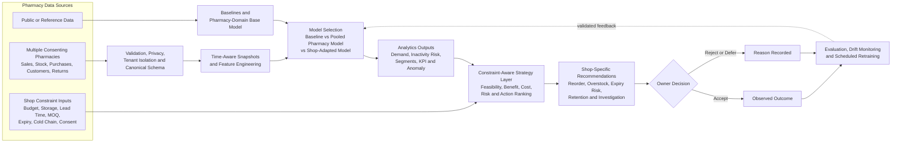

# Pharmacy vertical scope and supervisor-guided system architecture

This document is the source of truth for the revised research scope agreed on
8 September 2026. It converts the supervisor's handwritten system sketch into
a precise research and product plan. If another document describes the primary
target as all SME types or as generic retail, this document takes precedence.

## 1. Fixed scope decision

- **Initial empirical domain:** Bangladeshi retail pharmacies.
- **Unit of deployment:** one pharmacy business, with one or more branches.
- **Training population:** multiple independent pharmacy businesses from the
  same vertical, subject to consent, ethics approval and data-quality checks.
- **Initial model objective:** build and validate a pharmacy-domain business
  analytics and recommendation model, not a universal model for every SME.
- **Future extension:** reuse the framework with new schemas, constraints,
  features and validated models for grocery, fashion, electronics and other SME
  verticals. No cross-sector generalization may be claimed before it is tested.

The approved thesis title can remain unchanged. The report and presentation
must state that the framework is extensible, while its first implementation and
empirical validation are deliberately limited to the pharmacy vertical.

## 2. Why one vertical is the defensible choice

Different SME categories have different products, demand cycles, regulations,
inventory risks and feasible actions. A model trained indiscriminately on
pharmacies, restaurants, clothing stores and service firms would mix
incomparable processes. Restricting the initial study to pharmacies provides:

- a coherent product and inventory structure;
- comparable demand and supplier processes across participating shops;
- enough shops for cross-business validation without claiming every SME is the
  same;
- pharmacy-specific constraints such as expiry, batch and cold-chain handling;
- a clear boundary for data collection, model evaluation and recommendations.

The thesis contribution is therefore a **pharmacy-focused implementation of an
extensible SME decision-support framework**.

## 3. Interpretation of the supervisor's sketch

The sketch is directionally correct and should be formalized as follows:

1. Base/reference evidence establishes simple baselines and, only when
   justified, a pooled pharmacy-domain model.
2. Multiple pharmacy businesses continuously generate operational data.
3. Every shop remains tenant-isolated; raw records are not exposed to another
   shop.
4. The analytics layer produces forecasts, risk scores, segments and KPIs.
5. Each shop supplies its own operational constraints through software inputs.
6. A separate strategy layer filters and ranks feasible actions using both the
   prediction and the shop's constraints.
7. The owner receives pharmacy- and shop-specific recommendations with reasons,
   confidence and supporting evidence.
8. Owner decisions and later outcomes are recorded for monitoring and periodic
   model improvement.
9. Baseline, pooled pharmacy model and shop-adapted alternatives are compared
   before a model is promoted.

The ML model must not be drawn as if it directly issues business commands.
Predictions and recommendations are separate: the model estimates what may
happen; the strategy layer decides which feasible action to suggest.

## 4. Presentation-ready architecture

Recommended slide title:

> **Pharmacy-Specific Constraint-Aware Continuous Recommendation Framework**

## 5. Data and model strategy

### 5.1 Data roles

Data sources must retain separate roles:

- **Public/reference data:** method development, schema testing, benchmark or
  external context; it is not automatically equivalent to pharmacy sales.
- **Pooled pharmacy research data:** de-identified records from multiple
  consenting pharmacies used to learn patterns shared within the vertical.
- **Individual-shop data:** tenant-owned operational history used for inference,
  constraint application and, when sufficient, shop adaptation/calibration.
- **Synthetic data:** software testing, rare scenarios and scalability only;
  never mixed into a reported real-world accuracy number.

### 5.2 Model hierarchy and cold start

The system must not promise a separate complex model for every shop regardless
of evidence. It selects the most defensible eligible option:

1. **Insufficient shop history:** transparent seasonal or moving-demand
   baseline; optionally a validated pooled pharmacy model.
2. **Moderate history:** pooled pharmacy model with shop, branch, product and
   context features, followed by shop-level calibration if validation supports
   it.
3. **Sufficient history:** compare a shop-adapted or shop-specific model against
   the pooled model and baseline on chronological validation data.
4. **Promotion rule:** use the more complex model only when it materially beats
   the relevant baseline and passes reliability, privacy and monitoring gates.

Cross-shop evaluation must include per-shop results and leave-one-shop-out or
held-out-shop testing. This measures whether the pharmacy-domain model transfers
to a pharmacy it did not train on.

## 6. Shop constraint profile collected through software

At onboarding and in settings, an owner or authorized manager will enter and
maintain constraints. Every value requires units, effective dates and an audit
history.

### General business constraints

- available purchasing budget and cash reserve;
- branch and storage capacity;
- supplier and typical lead time;
- minimum order quantity, pack size and purchase multiples;
- current stock, incoming stock and backorders;
- product/category purchasing limits;
- target service level, safety-stock policy and risk preference;
- customer contact consent and campaign capacity.

### Pharmacy-specific constraints

- batch/lot number and expiry date;
- minimum remaining shelf life accepted at purchase;
- cold-chain or temperature-sensitive storage capacity;
- prescription/controlled-item classification where applicable;
- supplier/manufacturer availability and substitution policy;
- return, recall, damaged-stock and near-expiry handling rules;
- unit form and pack conversion, for example box, strip and piece;
- regulatory or owner-defined restrictions on promotion and customer contact.

Constraints are not all ML features. They primarily enter the recommendation
layer, which checks feasibility after the analytics layer produces predictions.

## 7. Recommendation scope

The first pharmacy model may support:

- branch-product demand forecasting;
- reorder quantity and reorder timing;
- stock-out risk and safety-stock review;
- overstock, slow-moving and near-expiry risk;
- purchase prioritization under a declared budget;
- supplier/lead-time investigation flags;
- consent-safe customer inactivity review;
- sales, margin, return and anomaly explanations;
- an explicit **no recommendation** result when evidence or constraints are
  insufficient.

The system is business decision support, not a clinical decision system. It
must not diagnose patients, prescribe medicines, recommend dosages or replace a
licensed pharmacist's professional judgment.

## 8. What "continuous" means

The Facebook analogy is useful for personalization but must be described
accurately:

- operational data and constraints are updated continuously as the shop uses
  the software;
- inference and recommendation refresh can run after relevant events or on a
  defined schedule;
- the deployed model remains versioned and stable while serving predictions;
- drift, error and business outcomes are monitored continuously;
- retraining occurs periodically or after a validated data-volume/drift trigger,
  not blindly after every transaction;
- a new model is deployed only after chronological comparison against the
  current model and baseline;
- rollback and audit history are retained.

Thus, **continuous learning means a monitored feedback lifecycle**, not
uncontrolled online retraining.

## 9. Evaluation required for thesis claims

### Predictive evaluation

- Forecasting: WAPE, MAE, RMSE, bias and interval coverage.
- Inactivity/risk: PR-AUC, ROC-AUC, Brier score, calibration and lift.
- Segmentation: stability, separation and pharmacy-owner interpretation.

### Personalization and transfer evaluation

- baseline versus pooled pharmacy model;
- pooled pharmacy model versus shop-adapted model;
- per-shop and held-out-shop performance;
- with versus without shop constraints;
- ablation of pharmacy-specific features such as expiry and lead time.

### Decision and business evaluation

- stock-out units and stock-out days;
- holding cost and expired-stock value;
- recommendation feasibility and acceptance rate;
- realized outcome after accepted recommendations;
- owner task correctness, decision time, confidence and usability.

Predictive accuracy alone does not prove business value. Final claims require
the decision and pilot outcome measures above.

## 10. Current implementation boundary

Already implemented in the prototype:

- organization/branch isolation;
- product, sales, purchase, inventory, return, supplier and customer records;
- reorder level, current/incoming stock, supplier lead time and consent checks;
- per-organization demand-model training and transparent baseline fallback;
- product/branch reorder, retention and anomaly action ranking;
- model-versus-baseline demand metrics.

Still required for the revised pharmacy design:

- pharmacy product master, batch/lot, expiry and pack conversion;
- cold-chain/storage and controlled-item constraint fields;
- purchasing budget, MOQ and category-limit inputs;
- pooled multi-pharmacy model and held-out-shop evaluation;
- validated shop adaptation/calibration;
- persistent recommendation, accept/reject/defer and outcome records;
- drift-triggered training workflow and version promotion/rollback;
- pharmacy-specific recommendation evaluation with consenting real shops.

Until these are implemented and tested, presentation slides must distinguish
**implemented prototype** from **proposed pharmacy extension**.

## 11. Required wording in report and presentation

Use:

> B-SMART is an extensible SME decision-support framework whose initial
> implementation and empirical validation target Bangladeshi retail pharmacies.
> A pharmacy-domain model learns shared patterns from multiple consenting,
> de-identified pharmacy datasets. For each deployed shop, current operational
> data and owner-supplied constraints are used to produce feasible,
> shop-specific recommendations. Other SME verticals remain future work and
> require separate data, constraints and validation.

Avoid:

- "The model works for every type of SME."
- "All shops share their raw data."
- "The AI directly decides what the owner must do."
- "The model retrains itself after every transaction."
- "Public or synthetic data prove effectiveness in Bangladeshi pharmacies."
- "The system provides medical or prescription advice."

## 12. Next implementation and research order

1. Freeze the pharmacy schema and constraint-input specification.
2. Add batch, expiry, pack/unit and pharmacy storage fields and migrations.
3. Add owner-facing constraint settings with validation and audit history.
4. Recruit multiple consenting pharmacies under the real-data protocol.
5. Build the pooled pharmacy baseline/model using time-safe splits.
6. Compare baseline, pooled and shop-adapted candidates per shop.
7. Connect predictions to the full constraint-aware strategy engine.
8. Persist owner decisions and observable outcomes.
9. Add monitoring, scheduled retraining, model promotion and rollback.
10. Run predictive, operational and owner-usability evaluations before making
    final effectiveness claims.
